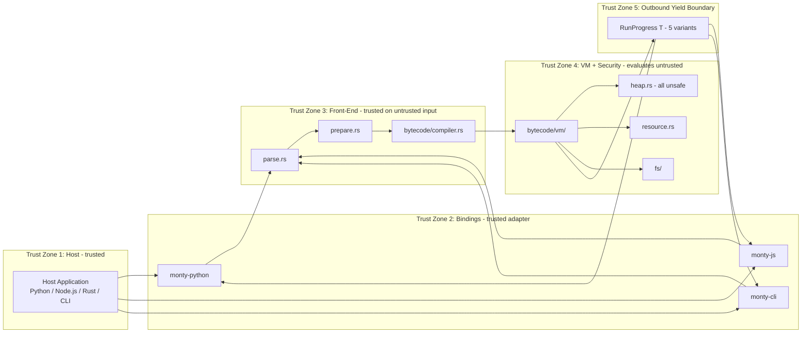
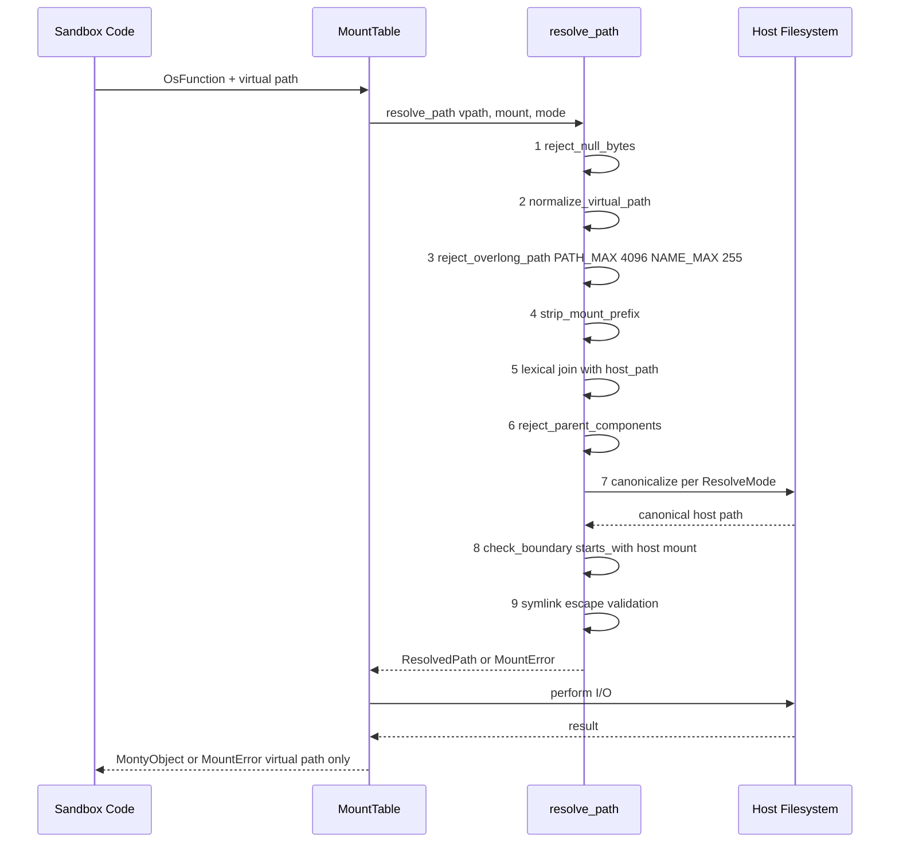
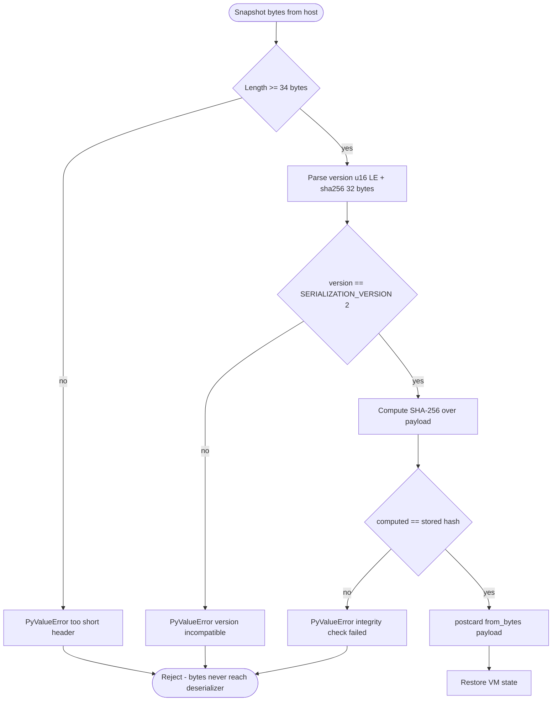
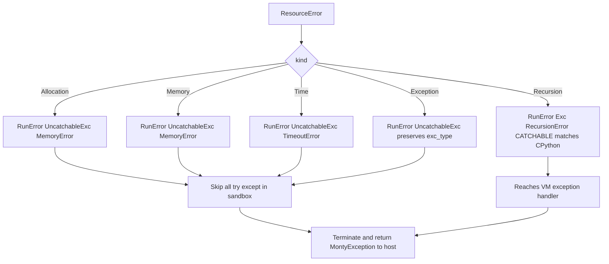
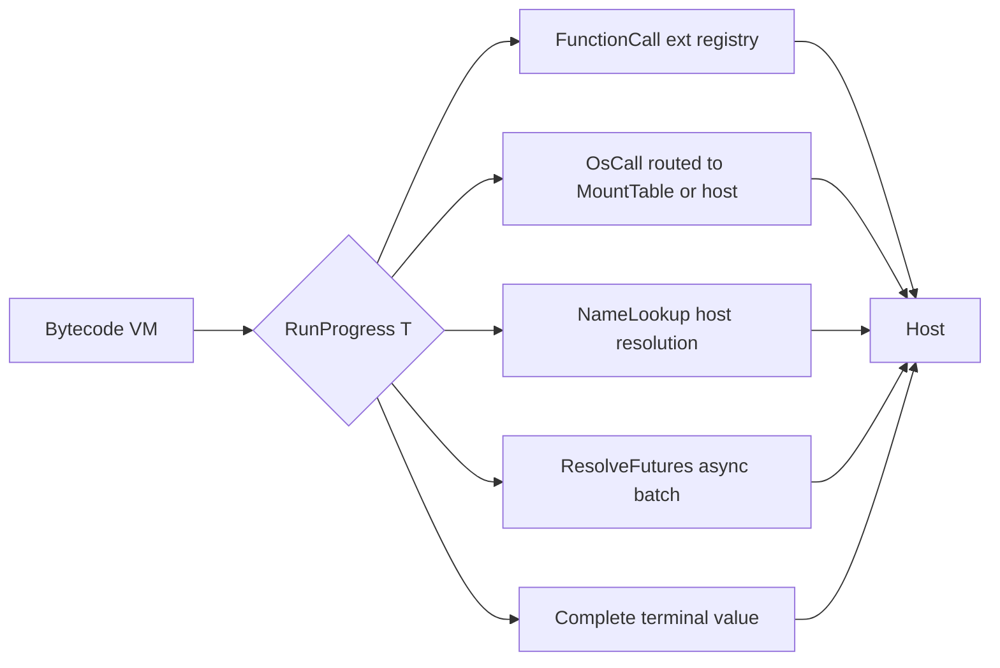

# Technical Specification

# 0. Agent Action Plan

## 0.1 Intent Clarification

### 0.1.1 Core Documentation Objective

Based on the provided requirements, the Blitzy platform understands that the documentation objective is to **produce a single, read-only static security audit report** for the Monty repository — an experimental sandboxed Python interpreter implemented in Rust with Python (PyO3) and JavaScript (napi-rs) bindings. The deliverable is a new markdown file, `SECURITY_AUDIT.md`, placed at the repository root. No existing file may be created, modified, or deleted, and no code in the repository may be executed, compiled, tested, linted, or otherwise invoked during the audit.

- Request category: **Create new documentation** (specifically, a new security-audit report artifact).
- Documentation type: **Technical security audit report** — a specialized cross between an architecture-level threat assessment and a code-level vulnerability inventory, produced entirely from static source inspection.
- Scope of creation: Exactly one new file (`SECURITY_AUDIT.md` at the repository root).

The following requirements are extracted and restated with enhanced technical clarity:

- **R1 — Read-Only Static Analysis.** Analysis is performed exclusively by reading source files. No dynamic execution, compilation, test execution, fuzzing, Miri invocation, or tool-assisted code generation is permitted. The audit's evidence base is file contents only.
- **R2 — Ten-Category Vulnerability Assessment.** The audit must produce a documented verdict for each of ten attack vector categories: (1) filesystem access and path traversal; (2) low-level code safety; (3) resource-limit evasion; (4) module system and built-in abuse; (5) infinite-loop and recursion DoS; (6) network and subprocess access; (7) external function and callback misuse; (8) deserialization attacks; (9) information leakage; (10) public API developer misuse.
- **R3 — Severity Taxonomy.** Findings are classified using a five-level taxonomy: Critical (sandbox escape with no preconditions), High (sandbox escape under attacker-controlled conditions or reliable DoS), Medium (information disclosure or partial bypass), Low (defense-in-depth gap), and Informational (best-practice deviation).
- **R4 — Priority-Ordered Audit Scope.** Components are examined in strict priority order: (1) filesystem security boundary and path resolution; (2) memory management and low-level runtime core; (3) sandboxed language runtime core; (4) public API surfaces; (5) project security documentation and stated invariants.
- **R5 — Security Invariant Assessment.** For every invariant documented in the project's own materials (`README.md`, `CLAUDE.md`, `AGENTS.md`, and the technical specification's §6.4), enforcement must be assessed across all code paths and assigned exactly one verdict: **Verified**, **Partially Verified**, **Unverified**, or **Violated**.
- **R6 — Recurrence Discipline.** Whenever a vulnerability pattern is identified, all call sites across the codebase must be searched for the same pattern. Each site must be listed with its own verdict.
- **R7 — Low-Level Code Inventory.** Every memory-unsafe Rust section (`unsafe` blocks, `unsafe fn`, `unsafe impl`) must be enumerated with file path, line range, the safety invariant relied upon, and whether calling code can violate that invariant.
- **R8 — Data-Flow Tracing.** Untrusted-input paths must be traced from entry (e.g., Python source, external-function argument, snapshot bytes) to any host-touching operation, documenting each hop with `file:line` references.
- **R9 — Public API Misuse Analysis.** Public API surfaces must be evaluated for insecure defaults or configurations that could lead a downstream developer to accidentally expose host capabilities.
- **R10 — Clean Verdict Requirement.** When no issue is found in a category, the audit must state that explicitly and cite the specific evidence examined. Silence is not an acceptable verdict.
- **R11 — Prose-Only Remediation Expression.** Every recommendation is expressed as prose. No patches, diffs, pseudocode, or before/after code blocks are permitted in the deliverable.
- **R12 — Consistency Invariant.** The Executive Summary's finding counts must match the Findings section's count exactly.
- **R13 — Zero-Modification Proof.** The deliverable is complete only when `git diff --stat` and `git status` show zero modifications to any existing file in the repository (the only new entry should be `SECURITY_AUDIT.md`).
- **R14 — Uncertain-Finding Handling.** Findings that cannot be fully resolved through static analysis must be classified at the higher severity and marked "requires dynamic verification." Every "no issue found" verdict must cite the specific evidence examined.
- **R15 — Out-of-Scope Documentation.** Runtime-only vulnerabilities — dynamic dispatch behavior, generated code, platform-specific runtime behavior — cannot be observed and must be documented in an Out-of-Scope section.

### 0.1.2 Special Instructions and Constraints

The user's prompt contains several directives that are preserved here verbatim for downstream agents:

- **User Example — operational boundary:** *"Blitzy MUST NOT modify, create, or delete any existing file. The sole permitted output is SECURITY_AUDIT.md at the repository root."*
- **User Example — analysis discipline:** *"Static analysis only — read source files. Do not execute, compile, run, or test any code."*
- **User Example — recommendation style:** *"Prose descriptions only. No patches, diffs, or pseudocode."*
- **User Example — no-issue-found discipline:** *"State that explicitly with evidence examined. Silence is not an acceptable verdict."*
- **User Example — severity classification taxonomy:** *"Critical: sandbox escape, no preconditions. High: sandbox escape under attacker-controlled conditions or reliable DoS. Medium: information disclosure or partial bypass. Low: defense-in-depth gap. Informational: best-practice deviation."*
- **User Example — attack scenarios:** *"Untrusted code attempting host access or exfiltration; maliciously crafted serialized state; developer misconfiguration of public APIs; resource exhaustion; side-channel observation via error messages or timing."*
- **User Example — priority order:** *"(1) Filesystem security boundary and path resolution — highest priority; (2) memory management and low-level runtime core — highest priority; (3) sandboxed language runtime core; (4) public API surfaces; (5) project security documentation and stated invariants."*
- **User Example — completeness check:** *"`git diff --stat` and `git status` show zero modifications to any existing file."*
- **User Example — invariant verdicts:** *"Verified / Partially Verified / Unverified / Violated."*
- **User Example — audit discipline guideline (interfaces):** *"All interfaces and APIs are references only — do not modify them."*

Additional binding constraints derived from the user's implementation rules:

- **Visual Architecture Documentation Rule (user-specified):** All visual documentation MUST use Mermaid diagrams. Every diagram MUST have a descriptive title and legend. Diagrams MUST be referenced by name in accompanying prose. When documenting an architecture, both current-state components (and any contrasting hypothetical attack-path states) should be shown where applicable.
- **Executive Presentation Rule (user-specified, scoped to this task):** Every deliverable MUST include an executive summary as a reveal.js HTML artifact is the project-wide rule. However, the task's **MINIMAL CHANGE CLAUSE explicitly restricts the sole permitted output to `SECURITY_AUDIT.md`**. Because the task-specific constraint is more restrictive and explicit, the Blitzy platform resolves this conflict as follows: the executive-summary obligation is satisfied in full **inside the `SECURITY_AUDIT.md` file itself** as its opening "Executive Summary" section, with embedded Mermaid diagrams. A separate `.html` reveal.js file is NOT produced because producing one would violate the "sole permitted output is `SECURITY_AUDIT.md`" clause. This resolution is captured explicitly in §0.10.

No templates, style preferences, or example audit files were provided by the user. No tone or depth directives beyond those implied by the severity taxonomy and `file:line` citation requirement were given. No web search requirements for documentation best practices were stated; however, established security-auditing conventions (CWE cross-references, CVSS-style severity reasoning) may inform the report's structure where helpful without being mandatory.

### 0.1.3 Technical Interpretation

These documentation requirements translate to the following technical documentation strategy:

- **To inventory and verify the filesystem security boundary**, the audit will read `crates/monty/src/fs/path_security.rs` (the nine-step resolve-path pipeline), `crates/monty/src/fs/mount_table.rs`, `crates/monty/src/fs/mount_mode.rs`, `crates/monty/src/fs/dispatch.rs`, `crates/monty/src/fs/direct.rs`, `crates/monty/src/fs/overlay.rs`, `crates/monty/src/fs/overlay_state.rs`, `crates/monty/src/fs/common.rs`, `crates/monty/src/fs/error.rs`, and `crates/monty/src/fs/mod.rs`, together with the regression test suite `crates/monty/tests/fs_security.rs`. The audit will document each gate's enforcement, trace how virtual paths flow to host paths, and mark each stated invariant's verdict.
- **To inventory low-level Rust code**, the audit will enumerate every `unsafe` block, `unsafe fn`, and `unsafe impl` found by reading `crates/monty/src/heap.rs`, `crates/monty/src/heap/heap_entries.rs`, and `crates/monty/src/heap_traits.rs` (the three files constituting the Rust `unsafe` concentration per `CLAUDE.md`), plus any `unsafe` usage in FFI crates (`crates/monty-js/src/convert.rs`, `crates/monty-js/src/monty_cls.rs`, `crates/monty-js/src/mount.rs`). For each occurrence, the audit will record file path, line range, the documented safety invariant, and whether a caller could feasibly violate the invariant.
- **To assess the sandboxed language runtime**, the audit will read `crates/monty/src/run.rs`, `crates/monty/src/run_progress.rs`, `crates/monty/src/resource.rs`, `crates/monty/src/os.rs`, `crates/monty/src/bytecode/` (VM, compiler, opcodes, builder), `crates/monty/src/modules/` (the hand-implemented sandboxed stdlib: `asyncio`, `datetime`, `json/`, `math`, `os`, `pathlib`, `re`, `sys`, `typing`), and `crates/monty/src/builtins/` to document which CPython behaviors are deliberately absent.
- **To evaluate public API surfaces**, the audit will read `crates/monty/src/lib.rs` (Rust re-exports), `crates/monty-python/src/lib.rs` and siblings (`monty_cls.rs`, `external.rs`, `limits.rs`, `serialization.rs`, `mount.rs`, `dataclass.rs`, `async_dispatch.rs`, `convert.rs`, `exceptions.rs`, `repl.rs`, `print_target.rs`), and `crates/monty-js/src/lib.rs` with its siblings (`convert.rs`, `exceptions.rs`, `limits.rs`, `monty_cls.rs`, `mount.rs`) to enumerate developer-facing entry points and assess insecure defaults.
- **To assess stated security invariants**, the audit will extract every "security invariant" or "must never" statement from `README.md`, `CLAUDE.md`, `AGENTS.md`, the technical specification's §6.4, and inline doc-comments, then map each to its enforcing code path and assign a verdict.
- **To trace untrusted-input data flows**, the audit will identify entry points — Python source (via `MontyRun::new`/`parse`), external-function arguments and return values (via `call_or_coroutine`), snapshot bytes (via `load`/`load_snapshot`), OS call returns (via host `os_callback`), and JSON/postcard deserialization — and trace each to the first host-touching operation, documenting every hop with a `file:line` reference.
- **To enforce zero-modification**, the audit writes only to the out-of-tree working path planned for `SECURITY_AUDIT.md`; no helper scripts, test files, or intermediate artifacts are created inside the repository.

### 0.1.4 Inferred Documentation Needs

The following needs are not explicitly stated in the user prompt but are logically implied and captured by the Blitzy platform so that the resulting `SECURITY_AUDIT.md` is complete and audit-defensible:

- **Based on the codebase's self-description in `README.md` and `CLAUDE.md`**: Monty is explicitly designed to "run untrusted, potentially malicious code." Every audit category therefore maps to a concrete runtime primitive, and the audit must express its verdicts in the vocabulary the codebase uses (`MountError`, `ResourceError`, `RunError`, `RunProgress`, `HeapReader`, `MontyException`, `OsFunction`).
- **Based on the five-crate public-API surface (`monty`, `monty-python`, `monty-js`, `monty-cli`, `monty-type-checking`)**: Every public entry point must be evaluated; a vulnerability reachable only from one binding but not another is still a finding, because downstream consumers arrive through different language surfaces.
- **Based on the three filesystem mount modes (`ReadOnly`, `ReadWrite`, `OverlayMemory`) defined in `crates/monty/src/fs/mount_mode.rs`**: Path-boundary findings must be evaluated against all three modes, and the audit must note whether `OverlayMemory` introduces additional information-leak surfaces (e.g., host-tree shadowing).
- **Based on the snapshot integrity envelope (`[version: u16 LE][SHA-256: 32 B][postcard payload]`) in `crates/monty-python/src/serialization.rs`**: The deserialization-attack category (#8) has a specific, named choke-point whose gates must each be individually assessed.
- **Based on the 19-variant `OsFunction` enum in `crates/monty/src/os.rs`**: The closed-catalog design must be explicitly verified (no `#[non_exhaustive]` escape hatch; exhaustive pattern matching enforced by `rustc`), and the audit should confirm that no variant is silently routed to a host capability that escapes sandbox policy.
- **Based on the `fancy-regex = 0.17.0` pin in `crates/monty/Cargo.toml`**: ReDoS defense depends on an engine default; downgrading or re-vendoring this dependency is itself a security event. The audit should note the pin's role in the regex-DoS category verdict.
- **Based on the uncatchable-error invariant (`From<ResourceError> for RunError` converting all resource exhaustions except `Recursion` to `UncatchableExc`)**: Any `try: ... except: pass` pattern inside sandboxed Python is defeated by this invariant — the audit must verify this is genuinely uncatchable by sandboxed Python code (no variant leaks catchable exceptions for allocation/time/memory).
- **Based on the hand-implemented sandboxed stdlib approach**: Absence of CPython's `os.system`, `os.popen`, `os.fork`, `os.exec*`, `subprocess`, `socket`, and `ctypes` must be actively verified by inspecting `crates/monty/src/modules/os.rs` and `crates/monty/src/builtins/` (not merely assumed).
- **Based on the Rust/PyO3/napi-rs FFI trust boundaries**: Every `unsafe` block in bindings must be reviewed for ABI-correct pointer handling, because a bindings-layer safety violation crosses the trust boundary back into the host process.
- **Based on the REPL capability (`MontyRepl` in `crates/monty/src/repl.rs` and `crates/monty-python/src/repl.rs`)**: The REPL's cancellation and cleanup paths are additional state-machine territory that must be included in the resource-exhaustion and memory-safety categories.
- **Based on the `examples/` directory** (which demonstrates developer usage patterns): Developer-misuse category verdicts should cite whether the documented usage patterns would produce secure defaults or whether a naive embedder could accidentally widen the sandbox.


## 0.2 Documentation Discovery and Analysis

### 0.2.1 Existing Documentation Infrastructure Assessment

Repository analysis reveals a documentation structure organized around **narrative markdown documents at the repository root** supplemented by **per-crate README files**, with **no dedicated `docs/` directory, no static-site generator (e.g., MkDocs, Docusaurus, Sphinx), and no API-documentation tool (JSDoc, Rustdoc-beyond-default, TypeDoc)** wired into a site build. Coverage of security-critical subsystems (filesystem boundary, heap invariants, resource limits, snapshot envelope) is substantial in `CLAUDE.md`/`AGENTS.md` and in the technical specification's §6.4, but there is no prior security-audit artifact at the repository root.

**Documentation files discovered at the repository root and in crate roots:**

| File | Role |
|---|---|
| `README.md` | Project overview, installation, Python/Rust usage examples, integration roadmap, alternatives comparison |
| `AGENTS.md` | Contributor manual; security policy, runtime architecture, test structure |
| `CLAUDE.md` | Operating manual for AI-assisted contributors; cross-platform rules, threat-model enumeration, heap-access conventions |
| `CODEX_REPORT.md` | Post-fix review report scoped to type-checking area |
| `RELEASING.md` | Release process across Cargo, npm, PyPI, GitHub Releases |
| `LICENSE` | MIT license and Pydantic Services Inc. copyright |
| `crates/monty-python/README.md` | Python package user documentation |
| `crates/monty-js/README.md` | JS package user documentation |
| `crates/monty-typeshed/README.md` | Typeshed vendor-snapshot crate documentation |
| `examples/README.md` | Top-level examples guide |
| `examples/expense_analysis/README.md` | Expense-analysis example walk-through |
| `examples/sql_playground/README.md` | SQL-playground example walk-through |
| `examples/web_scraper/README.md` | Web-scraper example walk-through |

- **Current documentation framework:** Plain markdown; no generator or theme configured. Rustdoc is implicitly available via `cargo doc` (`crates/monty/src/lib.rs` uses `#![doc = include_str!("../../../README.md")]`), but no `.mkdocs.yml`, `docusaurus.config.js`, `sphinx.conf.py`, `readthedocs.yaml`, or equivalent is present.
- **Documentation generator configuration location:** Not applicable (none configured).
- **API documentation tools in use:** Rustdoc (default). PyO3 bindings inherit any `#[pyo3(...)]` docstrings. No formal JSDoc, TypeDoc, Sphinx, or MkDocs config was found.
- **Diagram tools detected:** Mermaid (as embedded code blocks in the technical specification and in prior discussions). No PlantUML, Graphviz `.dot`, or image assets were discovered.
- **Documentation hosting/deployment setup:** None at the repository root. No ReadTheDocs, GitHub Pages, Netlify, or equivalent configuration was found.
- **Pre-existing security-audit artifacts:** None. A file search for `SECURITY*.md` at the repository root returns no matches, confirming that `SECURITY_AUDIT.md` is a net-new artifact.
- **Pre-existing security policy files:** No `SECURITY.md` (GitHub vulnerability-disclosure policy file) was discovered at the repository root. Its absence is informational but not a finding unto itself within the scope of this audit.

### 0.2.2 Repository Code Analysis for Documentation

The Blitzy platform has surveyed the source tree along the five priority axes specified by the user. The following inventory enumerates the specific directories, files, and modules that must be read to produce an evidence-based audit. Every path below is a real, verified path discovered through repository inspection.

**Search patterns employed:**

- Filesystem boundary code: `crates/monty/src/fs/**/*.rs`, `crates/monty/tests/fs_security.rs`, `crates/monty/tests/fs.rs`
- Low-level / `unsafe` code: `crates/monty/src/heap.rs`, `crates/monty/src/heap/heap_entries.rs`, `crates/monty/src/heap_traits.rs`, `crates/monty-js/src/convert.rs`, `crates/monty-js/src/monty_cls.rs`, `crates/monty-js/src/mount.rs`
- Sandboxed runtime core: `crates/monty/src/run.rs`, `crates/monty/src/run_progress.rs`, `crates/monty/src/resource.rs`, `crates/monty/src/os.rs`, `crates/monty/src/bytecode/**/*.rs`, `crates/monty/src/parse.rs`, `crates/monty/src/prepare.rs`, `crates/monty/src/modules/**/*.rs`, `crates/monty/src/builtins/**/*.rs`
- Public API surfaces: `crates/monty/src/lib.rs`, `crates/monty-python/src/lib.rs` and siblings, `crates/monty-js/src/lib.rs` and siblings, `crates/monty-cli/src/main.rs`, `crates/monty-type-checking/src/lib.rs`
- Stated security invariants: `README.md`, `CLAUDE.md`, `AGENTS.md`, `Cargo.toml` (workspace lints and feature flags), per-crate `Cargo.toml` files, `.github/workflows/ci.yml`, `.pre-commit-config.yaml`, `clippy.toml`, inline `// SAFETY:` comments in all `.rs` files

**Key directories examined and their audit relevance:**

| Directory | Audit Relevance |
|---|---|
| `crates/monty/src/fs/` | Highest-priority filesystem security boundary (10 files) |
| `crates/monty/src/heap/`, `heap.rs`, `heap_traits.rs` | Highest-priority low-level unsafe code concentration |
| `crates/monty/src/bytecode/` | Sole evaluator of untrusted Python code |
| `crates/monty/src/modules/` | Hand-implemented sandboxed stdlib (minimal surface) |
| `crates/monty/src/builtins/` | Built-in functions with deliberate exclusions |
| `crates/monty-python/src/` | PyO3 public API, snapshot serialization, external-function registry |
| `crates/monty-js/src/` | napi-rs public API and native binding unsafe code |
| `crates/monty-cli/src/` | CLI-only policy (external functions disabled) |
| `crates/monty/tests/fs_security.rs` | 1,091-line filesystem regression suite |
| `crates/monty/tests/resource_limits.rs` | 1,984-line resource-limit regression suite |
| `crates/monty/tests/regex.rs` | ReDoS regression suite |
| `crates/monty/tests/heap_reader_compile_fail.rs` | Six compile-fail tests enforcing heap borrow invariants |
| `crates/fuzz/fuzz_targets/` | libFuzzer targets for parser and runtime |
| `.github/workflows/ci.yml` | Miri, fuzz, cross-platform, and SLSA publishing jobs |
| `.github/zizmor.yml` | GitHub Actions supply-chain linting configuration |

**Related documentation sources used as evidentiary anchors for the audit report:**

- `README.md` — Statements about blocked host access, snapshotting, resource usage control, and "cannot do" list (class definitions, match statements, third-party libraries, full stdlib access).
- `CLAUDE.md` — Explicit threat enumeration including filesystem access, path traversal, memory errors, excessive memory usage, infinite loops, network access, subprocess/shell execution, import system abuse, external callback misuse, deserialization attacks, regex/string DoS, information leakage via timing or error messages, and host-exposing APIs.
- `AGENTS.md` — `HeapReader`/`HeapRead`/`HeapReadOutput` conventions, `defer_drop!`/`HeapGuard`/`drop_with_heap` cleanup patterns, mount system callouts, and cross-platform rules.
- Technical specification §6.4 — Five-trust-zone model, nine-step path-resolution pipeline, snapshot integrity envelope, uncatchable-error invariant, DoS pre-check family, ReDoS backtrack limit, supply-chain pins.

### 0.2.3 Web Search Research Conducted

No web search is required for the audit's evidence-gathering phase — the evidence base is entirely the local repository, per the user's "Static analysis only — read source files" directive. However, the audit report may reference widely known security vocabulary (CWE identifiers, OWASP sandbox-escape patterns, ReDoS, time-of-check/time-of-use, symlink-escape) where doing so improves clarity. Such references are drawn from established security literature conventions and do not require a real-time lookup, because:

- Best practices for sandboxed-interpreter security documentation are well-established (NIST SP 800-53 AC-4 information-flow enforcement; CWE-22 path traversal; CWE-502 deserialization of untrusted data; CWE-400 uncontrolled resource consumption; CWE-1333 regex inefficient complexity).
- Documentation structure conventions for security audit reports (Executive Summary → Scope → Findings → Invariants Assessment → Low-Level Code Inventory → Recommendations → Out of Scope) are canonical within the security-assessment industry.
- Recommended diagram types for a sandbox architecture (trust-zone diagram, data-flow diagram, sequence diagram of the path-resolution pipeline) are conventional.
- Tools and techniques for maintaining security documentation are a long-run concern outside this task's read-only scope.

If, while authoring the audit, the assessing agent determines that a third-party CVE or advisory reference is required to substantiate a finding (e.g., a CVE pertaining to `fancy-regex`, `postcard`, `pyo3`, or `napi`), one-shot lookups against authoritative sources (the dependency's GitHub security advisories tab, crates.io RUSTSEC, OSV.dev) are permitted because they remain non-modifying and do not involve running any repository code. Such lookups, if performed, must be cited in the Findings section.


## 0.3 Documentation Scope Analysis

### 0.3.1 Code-to-Documentation Mapping

The audit produces a single `SECURITY_AUDIT.md` document, but that document must reference and evaluate the entire security-sensitive surface of the repository. The following mapping enumerates every code module the audit will read and the audit sections that each module will feed into.

**Modules requiring coverage in `SECURITY_AUDIT.md` (priority-ordered per user instruction R4):**

| Module / File | Key Security Elements | Audit Report Section Destination |
|---|---|---|
| `crates/monty/src/fs/path_security.rs` | Nine-step pipeline, `PATH_MAX=4096`, `NAME_MAX=255`, `ResolveMode` enum, symlink-escape rejection | Findings §1 (Filesystem), Invariants §1 |
| `crates/monty/src/fs/mount_table.rs` | `MountTable` routing, cross-mount rename rejection, transactional take/put | Findings §1 (Filesystem) |
| `crates/monty/src/fs/mount_mode.rs` | `ReadOnly`/`ReadWrite`/`OverlayMemory` variants and parsing | Findings §1 (Filesystem), Scope |
| `crates/monty/src/fs/dispatch.rs` | `OsFunction → FsRequest` router; read-only write-reject | Findings §1 (Filesystem) |
| `crates/monty/src/fs/direct.rs` | Host-backed execution; write-quota enforcement | Findings §1 (Filesystem) |
| `crates/monty/src/fs/overlay.rs` | Copy-on-write overlay read/write paths | Findings §1 (Filesystem), §9 (Info Leak) |
| `crates/monty/src/fs/overlay_state.rs` | `OverlayEntry` variants (files, refs, tombstones, synthetic dirs) | Findings §1 |
| `crates/monty/src/fs/common.rs` | Shared FS helpers; UTF-8 decoding; quota accounting | Findings §1 |
| `crates/monty/src/fs/error.rs` | `MountError` taxonomy; exception rendering; virtual-path-only invariant | Findings §9 (Info Leak), Invariants §9 |
| `crates/monty/src/fs/mod.rs` | Public FS namespace (`MountError`, `MountMode`, `Mount`, `MountTable`, `OverlayState`) | Findings §10 (Public API) |
| `crates/monty/src/heap.rs` (1,667 lines) | All runtime `unsafe`; reader-count invariant; `dec_ref` panic | Low-Level Code Inventory; Findings §2 |
| `crates/monty/src/heap/heap_entries.rs` | Paged storage with `UnsafeCell`; allocate-while-reading soundness | Low-Level Code Inventory; Findings §2 |
| `crates/monty/src/heap_traits.rs` | `HeapGuard`/`ImmutableHeapGuard`; `defer_drop!` macros; `ManuallyDrop::take` | Low-Level Code Inventory; Findings §2 |
| `crates/monty/tests/heap_reader_compile_fail.rs` | Six compile-fail cases enforcing borrow invariants | Invariants §2 |
| `crates/monty/src/resource.rs` (603 lines) | `ResourceTracker` trait; DoS pre-checks; `ResourceError`→`RunError` catchability map | Findings §3 (Resource), Invariants §3 |
| `crates/monty/src/run.rs` | `MontyRun`, `Executor`, `dump`/`load`, main execution entry | Findings §10 (Public API), §7 (External) |
| `crates/monty/src/run_progress.rs` | Five-variant `RunProgress<T>` outbound-yield contract | Findings §10 (Public API), §7 (External) |
| `crates/monty/src/os.rs` (286 lines) | 19-variant closed `OsFunction` enum; virtual-path guarantees for `Resolve`/`Absolute` | Findings §1 (FS), §9 (Info Leak) |
| `crates/monty/src/bytecode/vm/` | Sole evaluator; instruction-tick resource checks | Findings §3 (Resource), §5 (DoS) |
| `crates/monty/src/bytecode/compiler.rs` | Two-pass lowering; opcode generation | Informational |
| `crates/monty/src/parse.rs` (1,764 lines) | Ruff integration; `MAX_NESTING_DEPTH`; rejected constructs | Findings §5 (Parser DoS) |
| `crates/monty/src/prepare.rs` | Scope resolution; comprehension isolation | Informational |
| `crates/monty/src/modules/` (9 files + json/ subfolder) | Hand-implemented sandboxed stdlib; minimal surface area | Findings §4 (Modules), §6 (Net/Subprocess) |
| `crates/monty/src/modules/os.rs` | Sandboxed `os` module: only `getenv` + `environ` | Findings §4, §6 |
| `crates/monty/src/modules/re.rs` | Delegates to `fancy-regex` | Findings §5 (DoS) |
| `crates/monty/src/modules/json/` | JSON loader/serializer; per-run string cache | Findings §8 (Deserialization) |
| `crates/monty/src/builtins/` (29 files) | Python built-in functions; deliberate omissions (`eval`, `exec`, `compile`, `open`, `__import__` specifics) | Findings §4 |
| `crates/monty/src/object.rs` | `MontyObject` public-facing object model | Findings §10 |
| `crates/monty/src/exception_public.rs` | `MontyException`, `StackFrame`, `CodeLoc` external shapes | Findings §9 (Info Leak) |
| `crates/monty/src/exception_private.rs` | Internal exception taxonomy; `RunError`; `UncatchableExc` | Findings §3 (Resource), Invariants §3 |
| `crates/monty/src/io.rs` | `PrintStream`, `PrintWriter`, buffers, callbacks, `Disabled` | Findings §9 |
| `crates/monty/src/lib.rs` (53 lines) | Public API re-exports | Findings §10 (Public API) |
| `crates/monty-python/src/lib.rs` | PyO3 module registration | Findings §10 |
| `crates/monty-python/src/monty_cls.rs` | `Monty` PyO3 class; primary developer entry | Findings §10 |
| `crates/monty-python/src/serialization.rs` (822 lines) | Snapshot envelope: `SERIALIZATION_VERSION=2`, `HEADER_SIZE=34`, SHA-256 | Findings §8 (Deserialization), Invariants §8 |
| `crates/monty-python/src/external.rs` (331 lines) | `ExternalFunctionRegistry`; fail-closed `is_coroutine`; `NOT_HANDLED` sentinel | Findings §7 (External), Invariants §7 |
| `crates/monty-python/src/limits.rs` (230 lines) | `CancellationFlag`, `FutureCancellationGuard`, `PySignalTracker` | Findings §3 (Resource) |
| `crates/monty-python/src/mount.rs` (229 lines) | `PyMountDir`; `SharedMount = Arc<Mutex<Option<Mount>>>` | Findings §1, §10 |
| `crates/monty-python/src/async_dispatch.rs` | `tokio::spawn_blocking` dispatch; REPL cleanup | Findings §3, §10 |
| `crates/monty-python/src/repl.rs` | REPL continuation and resume | Findings §3, §10 |
| `crates/monty-python/src/dataclass.rs` | Dataclass self-argument validation | Findings §7 |
| `crates/monty-python/src/convert.rs` | Python↔Rust value conversion | Findings §9 |
| `crates/monty-python/src/exceptions.rs` | Python exception constructors | Findings §9 |
| `crates/monty-python/src/print_target.rs` | Print destination configuration | Findings §9 |
| `crates/monty-js/src/lib.rs` | napi-rs module registration | Findings §10 |
| `crates/monty-js/src/monty_cls.rs` | Node.js `Monty` class; N-API unsafe FFI calls | Low-Level Code Inventory; Findings §10 |
| `crates/monty-js/src/convert.rs` | JS↔Rust conversion; 3 `unsafe` blocks | Low-Level Code Inventory |
| `crates/monty-js/src/mount.rs` | `MountDir` JS binding; 2 `unsafe` FFI uses | Low-Level Code Inventory |
| `crates/monty-js/src/exceptions.rs` | JS exception shapes | Findings §9 |
| `crates/monty-js/src/limits.rs` | JS-layer resource limits | Findings §3 |
| `crates/monty-cli/src/main.rs` | CLI: `EXT_FUNCTIONS: bool = false`; mount parsing | Findings §10 |
| `crates/monty-type-checking/src/lib.rs` | Static type checker (non-runtime) | Informational |

**Configuration files requiring evaluation:**

| Config File | Options of Interest | Purpose in the Audit |
|---|---|---|
| `Cargo.toml` (workspace) | Workspace members, workspace-level dependency pins (Tokio `{rt, sync}`, Ruff git rev, salsa), lint policy, release profile (`lto = "fat"`, `codegen-units = 1`, `strip = true`) | Verify supply-chain discipline; confirm hardened release profile |
| `crates/monty/Cargo.toml` | `fancy-regex = 0.17.0`, `jiter`, serde, postcard; `ref-count-panic` and `ref-count-return` feature flags | Confirm ReDoS pin and test-only refcount features |
| `crates/monty-python/Cargo.toml` | `pyo3 = 0.28`, `pyo3-async-runtimes = 0.28`, `tokio = {rt, sync}`, `sha2 = 0.10`, `postcard = 1.1` | Confirm Tokio feature-minimization; snapshot integrity crate |
| `crates/monty-js/Cargo.toml` | `napi 3.0` with `napi6` and `compat-mode`; edition 2021 (workspace is 2024) | Note N-API version and edition difference |
| `crates/monty-cli/Cargo.toml` | Clap, rustyline; no external-function dependency | Confirm CLI external-function disabled |
| `crates/fuzz/Cargo.toml` | `libfuzzer-sys = 0.4`, arbitrary inputs | Note fuzz harness presence and budget |
| `crates/monty-type-checking/Cargo.toml` | `ty` integration | Informational |
| `.github/workflows/ci.yml` | `permissions: {}`, commit-SHA-pinned actions, Miri, fuzz, cross-platform matrix, PyPI Trusted Publishing | Supply-chain posture confirmation |
| `.github/workflows/codspeed.yml` | Benchmarking job | Informational |
| `.github/workflows/init-npm-packages.yml` | npm bootstrap; SLSA provenance | Supply-chain posture confirmation |
| `.github/zizmor.yml` | GHA security-lint configuration | Supply-chain posture confirmation |
| `.pre-commit-config.yaml` | `zizmor 1.23.1`, `codespell`, `yamlfmt`, Rust/Python/TS lint hooks | Local-hook supply-chain posture |
| `pyproject.toml` | Ruff, Pyright, Codespell tool configuration | Informational |
| `clippy.toml` | Absolute-path length policy | Informational |

### 0.3.2 Documentation Gap Analysis

Given the user's requirements and the repository analysis above, the specific gaps that `SECURITY_AUDIT.md` must fill are as follows. The words "gap" here refers to **documentation artifact gaps** — subject matter the user explicitly asks the audit to cover that does not presently exist in the repository in the expected form. It does **not** mean code-level security gaps (those, if any, are captured by the audit's Findings section, which is runtime analysis output, not documentation structure).

- **Undocumented artifact — Security Audit Report.** No `SECURITY_AUDIT.md` or equivalent report exists at the repository root. This is the single primary artifact the audit must produce.
- **Undocumented artifact — Executive Summary for non-technical readers.** While `CLAUDE.md` enumerates threats and the technical specification's §6.4 describes controls, there is no stakeholder-oriented executive summary that consolidates posture, finding counts, and risk in a way suitable for leadership review. The audit satisfies this gap via the Executive Summary section of `SECURITY_AUDIT.md`.
- **Undocumented artifact — Ten-Category Verdict Matrix.** The technical specification contains a consolidated security control matrix (§6.4.8.1) listing controls, but it does not map to the specific ten-category taxonomy the user prescribes. `SECURITY_AUDIT.md` produces the one-to-one verdict matrix.
- **Undocumented artifact — Explicit Security-Invariant Verdict List.** The codebase and tech spec list many invariants, but no single artifact assigns each invariant a `Verified / Partially Verified / Unverified / Violated` verdict. The audit fills this with its Security Invariants Assessment section.
- **Undocumented artifact — Low-Level Code Inventory.** While `heap.rs` is identified as the `unsafe` concentration, there is no file that enumerates each individual `unsafe` block (including those in `monty-js` FFI) along with the invariant each relies on and whether callers can violate that invariant. The audit fills this gap via its Low-Level Code Inventory section.
- **Undocumented artifact — Recommendations Table by Severity and Effort.** The recommendations for hardening are scattered across `AGENTS.md`, `CLAUDE.md`, and commit history. `SECURITY_AUDIT.md` produces a prioritized, severity-grouped recommendations table.
- **Undocumented artifact — Static-Analysis Out-of-Scope Boundary.** Runtime-only behaviors the audit cannot observe must be enumerated so readers know what else must be dynamically verified. `SECURITY_AUDIT.md` will include an explicit Out-of-Scope section.

The audit does **not** need to create `docs/` directories, tutorials, API references, user guides, or any other documentation beyond `SECURITY_AUDIT.md`. All other documentation remains untouched per the MINIMAL CHANGE CLAUSE.


## 0.4 Documentation Implementation Design

### 0.4.1 Documentation Structure Planning

The deliverable is a single markdown file. The internal structure of `SECURITY_AUDIT.md` is designed so that each section corresponds to an explicit user requirement and so that a reader can verify requirement-to-section coverage by eye.

```
<repo_root>/
└── SECURITY_AUDIT.md          [CREATE]  ← the ONLY file this task produces
    ├─ Title + metadata
    ├─ 1. Executive Summary
    │   ├─ Posture statement
    │   ├─ Finding-count table (must match Findings section exactly — R12)
    │   ├─ Trust-zone Mermaid diagram
    │   └─ Top risks at a glance
    ├─ 2. Scope
    │   ├─ Components examined (priority-ordered per R4)
    │   ├─ Attack-vector categories covered (10 categories — R2)
    │   ├─ Audit method disclaimer (static, read-only — R1)
    │   └─ Audit trail artifacts examined (files, line counts)
    ├─ 3. Findings
    │   (ordered by severity; each finding self-contained per R11)
    │   ├─ For each finding:
    │   │   ├─ ID (e.g., SA-F-001)
    │   │   ├─ Title
    │   │   ├─ Severity (Critical / High / Medium / Low / Informational)
    │   │   ├─ Category (one of the 10)
    │   │   ├─ file:line reference(s)
    │   │   ├─ Description
    │   │   ├─ Exploit scenario (attacker model + preconditions)
    │   │   └─ Prose remediation recommendation
    │   └─ Per-category "No Issue Found" statements with evidence (R10)
    ├─ 4. Security Invariants Assessment
    │   ├─ Tabular verdict list: invariant → verdict → evidence (R5)
    │   └─ Sequence diagram of filesystem path-resolution pipeline
    ├─ 5. Low-Level Code Inventory
    │   ├─ Every unsafe block enumerated (R7)
    │   ├─ file:line range per entry
    │   ├─ Safety invariant relied upon
    │   └─ Whether calling code can violate the invariant
    ├─ 6. Recommendations
    │   ├─ By severity (Critical → Informational)
    │   ├─ By effort (Low / Medium / High)
    │   └─ Prose-only (no patches — R11)
    └─ 7. Out of Scope
        ├─ Runtime-only observations (R15)
        ├─ Dynamic dispatch, generated code, platform-specific behavior
        └─ Findings requiring dynamic verification (R14)
```

### 0.4.2 Content Generation Strategy

**Information-Extraction Approach.** The audit's evidence gathering happens entirely through static file reading. Each finding and each invariant verdict is backed by direct citation of source code at specific line numbers.

- Extract filesystem-boundary invariants by reading `crates/monty/src/fs/path_security.rs`, noting the constants `PATH_MAX` and `NAME_MAX`, the `ResolveMode` enum, and the mode-specific resolver functions (`resolve_existing`, `resolve_lstat`, `resolve_creation`, `resolve_mkdir_parents`, `validate_creation_symlink_target`, `reject_escaping_symlink`).
- Extract heap-safety invariants by reading `crates/monty/src/heap.rs`, `crates/monty/src/heap/heap_entries.rs`, and `crates/monty/src/heap_traits.rs`, enumerating every `unsafe` block, `unsafe fn`, and `unsafe impl`.
- Extract resource-limit invariants by reading `crates/monty/src/resource.rs`, tracing `ResourceError` → `RunError` conversion and confirming the `UncatchableExc` routing for non-`Recursion` kinds.
- Extract snapshot-integrity invariants by reading `crates/monty-python/src/serialization.rs`, documenting the three-gate decode pipeline (length → version → SHA-256) and the `#[serde(skip, default)]` runtime-only fields.
- Extract external-function invariants by reading `crates/monty-python/src/external.rs`, documenting the `is_coroutine` fail-closed semantics, the `NOT_HANDLED` sentinel, and the `dispatch_method_call` self-validation.
- Extract OS-operation invariants by reading `crates/monty/src/os.rs`, confirming the 19-variant closed enum, `is_filesystem`/`is_write`/`is_existence_check` predicates, and the default-rejection `on_no_handler` behavior.
- Extract sandboxed-stdlib restriction evidence by reading `crates/monty/src/modules/os.rs`, `modules/mod.rs`, and the absence list (no `subprocess`, `socket`, `ctypes`, `os.system`, `os.popen`, `os.fork`, `os.exec*`).
- Extract regex-DoS invariants by reading `crates/monty/src/modules/re.rs` and noting the delegation to `fancy-regex = 0.17.0` with its 1,000,000-step default backtrack limit.
- Extract parser limits by reading `crates/monty/src/parse.rs` and noting `MAX_NESTING_DEPTH` (200 release, 35 debug) and any `MAX_SOURCE_SIZE` or per-node limit.
- Extract supply-chain posture by reading the workspace `Cargo.toml`, each crate's `Cargo.toml`, and `.github/workflows/ci.yml` for commit-SHA pins, `permissions: {}`, Miri/fuzz/Trusted Publishing jobs.

**Template Application.** No user-provided template exists. The audit follows the canonical security-assessment report structure shown in §0.4.1, which is explicitly requested by the user's prompt ("*What sections must SECURITY_AUDIT.md contain?*"). Each finding follows a fixed schema: `ID`, `Title`, `Severity`, `Category`, `file:line`, `Description`, `Exploit scenario`, `Prose remediation`.

**Documentation Standards.** The audit report conforms to the following formatting rules:

- Markdown with conventional headers (`#` for title, `##` for top-level report sections, `###` for findings and sub-items).
- Mermaid diagrams embedded via fenced `mermaid` code blocks. Every diagram is given a descriptive title in the surrounding prose and an on-diagram legend (either as a legend node or as prose-adjacent text) per the Visual Architecture Documentation rule.
- Source citations as inline `file:line` references, e.g., `crates/monty/src/fs/path_security.rs:L123-L145`. No footnote citations are used, because `file:line` inline references are more grep-friendly and align with the user's "Include a file:line reference for every finding" directive.
- Tables for parameter descriptions, finding summaries, and invariant verdicts (Markdown pipe-table syntax).
- Prose-only for remediation recommendations (no patches, no pseudocode — R11).
- Consistent terminology matching the codebase vocabulary: `MountError`, `MountTable`, `ResourceError`, `RunError`, `HeapReader`, `HeapGuard`, `MontyRun`, `MontyException`, `OsFunction`, `RunProgress`, `UncatchableExc`, `SERIALIZATION_VERSION`, `HEADER_SIZE`, `PATH_MAX`, `NAME_MAX`, `SIGNAL_CHECK_INTERVAL`, `TIME_CHECK_INTERVAL`, `LARGE_RESULT_THRESHOLD`, `DEFAULT_MAX_RECURSION_DEPTH`.

### 0.4.3 Diagram and Visual Strategy

Per the user-specified Visual Architecture Documentation rule, every diagram uses Mermaid. The audit includes the diagrams listed below; each is named, titled, and referenced by name in accompanying prose. These are the only visual elements — no screenshots, no generated images, no PlantUML.

**Diagram 1 — Trust Zones of the Monty Sandbox (for the Executive Summary).**

This flowchart shows the five trust zones (Host, Binding Layer, Front-End, VM+Security, Outbound Yield Boundary) as they correspond to the audit's component-priority axis. It is referenced by prose in the Executive Summary.



**Diagram 2 — Filesystem Path-Resolution Pipeline (for Findings §1 and Invariants §1).**

This sequence diagram shows the nine security gates traversed by `fs::path_security::resolve_path()` when a virtual path is translated to a host path.



**Diagram 3 — Snapshot Integrity Flow (for Findings §8).**

This flowchart shows the three gates (length, version, SHA-256) that every snapshot byte-string must pass before `postcard::from_bytes` is invoked.



**Diagram 4 — Resource-Error Catchability Routing (for Findings §3).**

This diagram illustrates how each `ResourceError` kind is mapped to a `RunError` variant, showing why `try: except:` cannot absorb non-`Recursion` exhaustion.



**Diagram 5 — Outbound-Yield Contract (for the Public API analysis, Findings §10).**

This component diagram shows the `RunProgress<T>` enum as the sole controlled egress path and enumerates its five variants.



No screenshot requirements apply (this is a code-only repository with no UI surface — see technical specification §7 for UI absence statement). No architecture diagram requirements beyond those listed above have been identified.


## 0.5 Documentation File Transformation Mapping

### 0.5.1 File-by-File Documentation Plan

The MINIMAL CHANGE CLAUSE constrains this task to **exactly one new file** and **zero modifications** to any existing file. The transformation table below makes the complete write-surface of the task explicit. Any subsequent request to modify another file must be rejected as out of scope for this audit.

**Documentation Transformation Modes (Legend):**

- **CREATE** — Create a new documentation file.
- **UPDATE** — Update an existing documentation file.
- **DELETE** — Remove an obsolete documentation file.
- **REFERENCE** — Use as an example for documentation style and structure (no writes).

| Target Documentation File | Transformation | Source Code / Docs | Content / Changes |
|---|---|---|---|
| `SECURITY_AUDIT.md` | CREATE | All source files enumerated in §0.3.1 | New security-audit report at the repository root. Contains: Title and metadata; Executive Summary (with finding-count table matching Findings exactly; trust-zone Mermaid diagram); Scope (ten-category list; priority-ordered components; static-analysis disclaimer; audit-trail artifact list); Findings (one entry per vulnerability with ID, Title, Severity, Category, file:line, Description, Exploit Scenario, Prose Remediation); per-category "no issue found" statements with evidence; Security Invariants Assessment (tabular Verified/Partially Verified/Unverified/Violated verdicts; path-resolution sequence diagram); Low-Level Code Inventory (every `unsafe` enumerated with file:line, invariant, and caller-violation analysis); Recommendations (by severity and effort, prose-only); Out of Scope (runtime-only observations). Mermaid diagrams embedded for Trust Zones, FS path-resolution, Snapshot integrity, Resource-error routing, Outbound-yield contract. |
| `README.md` | _(no change — MINIMAL CHANGE CLAUSE)_ | n/a | Must NOT be modified. Existing "Cannot do" and security-posture content is reused as an audit-evidence citation in `SECURITY_AUDIT.md` but the file itself is untouched. |
| `CLAUDE.md` | _(no change — MINIMAL CHANGE CLAUSE)_ | n/a | Must NOT be modified. Cited as the authoritative source of stated security invariants in the Invariants section of `SECURITY_AUDIT.md`. |
| `AGENTS.md` | _(no change — MINIMAL CHANGE CLAUSE)_ | n/a | Must NOT be modified. Cited as the authoritative source for heap-access conventions and cross-platform policy. |
| `RELEASING.md` | _(no change — MINIMAL CHANGE CLAUSE)_ | n/a | Must NOT be modified. Cited as context for supply-chain posture (PyPI, npm, GitHub Releases). |
| `CODEX_REPORT.md` | _(no change — MINIMAL CHANGE CLAUSE)_ | n/a | Must NOT be modified. Not in scope. |
| `crates/monty-python/README.md` | _(no change — MINIMAL CHANGE CLAUSE)_ | n/a | Must NOT be modified. May be cited in the Public API developer-misuse analysis. |
| `crates/monty-js/README.md` | _(no change — MINIMAL CHANGE CLAUSE)_ | n/a | Must NOT be modified. May be cited in the Public API developer-misuse analysis. |
| `crates/monty-typeshed/README.md` | _(no change — MINIMAL CHANGE CLAUSE)_ | n/a | Must NOT be modified. Not in direct audit scope (type-checking data only). |
| `examples/README.md` | _(no change — MINIMAL CHANGE CLAUSE)_ | n/a | Must NOT be modified. |
| `examples/expense_analysis/README.md` | _(no change — MINIMAL CHANGE CLAUSE)_ | n/a | Must NOT be modified. |
| `examples/sql_playground/README.md` | _(no change — MINIMAL CHANGE CLAUSE)_ | n/a | Must NOT be modified. |
| `examples/web_scraper/README.md` | _(no change — MINIMAL CHANGE CLAUSE)_ | n/a | Must NOT be modified. |
| `LICENSE` | _(no change — MINIMAL CHANGE CLAUSE)_ | n/a | Must NOT be modified. |
| `Makefile` | _(no change — MINIMAL CHANGE CLAUSE)_ | n/a | Must NOT be modified. The audit does not invoke `make` — see §0.9. |
| `.pre-commit-config.yaml`, `.codecov.yml`, `.rustfmt.toml`, `.yamlfmt.yaml`, `clippy.toml` | _(no change — MINIMAL CHANGE CLAUSE)_ | n/a | Must NOT be modified. Cited only as supply-chain posture evidence. |
| `Cargo.toml`, `pyproject.toml`, per-crate manifests | _(no change — MINIMAL CHANGE CLAUSE)_ | n/a | Must NOT be modified. Cited as version-pin evidence. |
| `Cargo.lock` | _(no change — MINIMAL CHANGE CLAUSE)_ | n/a | Must NOT be modified. Never touched. The audit does not run `cargo update`, `cargo build`, or any command that would rewrite the lock file. |
| `.github/workflows/*.yml` | _(no change — MINIMAL CHANGE CLAUSE)_ | n/a | Must NOT be modified. Cited as evidence of CI supply-chain posture (`permissions: {}`, commit-SHA pins, Miri/fuzz jobs). |
| `.github/zizmor.yml` | _(no change — MINIMAL CHANGE CLAUSE)_ | n/a | Must NOT be modified. Cited as evidence of GitHub Actions security linting. |
| `crates/**/*.rs` | _(no change — MINIMAL CHANGE CLAUSE)_ | n/a | Must NOT be modified. Every Rust source file is READ-ONLY evidence. Audit cites `file:line`. |
| `crates/**/test_cases/**/*.py` | _(no change — MINIMAL CHANGE CLAUSE)_ | n/a | Must NOT be modified. |
| `crates/**/tests/**/*.rs` | _(no change — MINIMAL CHANGE CLAUSE)_ | n/a | Must NOT be modified. Regression suites cited as invariant-verification evidence. |
| `scripts/**/*.py` | _(no change — MINIMAL CHANGE CLAUSE)_ | n/a | Must NOT be modified. Automation utilities; not directly in audit scope. |
| `crates/fuzz/**` | _(no change — MINIMAL CHANGE CLAUSE)_ | n/a | Must NOT be modified. Cited for fuzz-harness existence and budget configuration. |
| `.claude/**`, `.cargo/**` | _(no change — MINIMAL CHANGE CLAUSE)_ | n/a | Must NOT be modified. |

The transformation table is **exhaustive**: only one CREATE row exists (`SECURITY_AUDIT.md`); every other file in the repository is explicitly held at "no change." No wildcard patterns are used that expand to multiple CREATE/UPDATE rows, because the task's contract is explicit about single-file output. No file is left as "pending" or "to be discovered" — the audit produces one file, reads many.

### 0.5.2 New Documentation Files Detail

```
File: SECURITY_AUDIT.md
Type: Static Security Audit Report
Location: Repository root (same directory as README.md, LICENSE, Cargo.toml)
Source Code: Entire repository; priority-ordered per §0.3.1
Sections:
    - Title and metadata (audit date, auditor identifier, commit SHA,
      scope statement, methodology statement)
    - 1. Executive Summary
        * Overall posture statement (concise)
        * Finding-count table (Critical / High / Medium / Low / Informational)
        * Trust-zone Mermaid diagram (Diagram 1 per §0.4.3)
        * Top risks at a glance (prose bullets)
    - 2. Scope
        * Components examined in priority order (R4)
        * All 10 attack-vector categories listed (R2)
        * Methodology: static analysis only, read-only (R1, R15)
        * Audit trail: artifact list with line counts and SHA references
    - 3. Findings
        * Per finding: ID (SA-F-NNN), Title, Severity, Category,
          file:line, Description, Exploit Scenario, Prose Remediation
        * Per-category "No Issue Found" statements (R10) with cited evidence
        * Findings ordered Critical → High → Medium → Low → Informational
    - 4. Security Invariants Assessment
        * Tabular verdicts: each invariant → Verified / Partially Verified /
          Unverified / Violated (R5), with file:line evidence
        * Filesystem path-resolution sequence diagram (Diagram 2)
        * Snapshot integrity flow diagram (Diagram 3)
        * Resource-error catchability routing diagram (Diagram 4)
    - 5. Low-Level Code Inventory
        * Every `unsafe` block and `unsafe fn` enumerated (R7)
        * Per entry: file path, line range, safety invariant relied upon,
          caller-violability analysis
        * Cross-reference to compile-fail test coverage
    - 6. Recommendations
        * By severity (Critical → Informational)
        * By effort (Low / Medium / High)
        * Prose-only per R11; no patches, diffs, or pseudocode
    - 7. Out of Scope
        * Runtime-only behaviors not observable statically (R15)
        * Dynamic dispatch, generated code, platform-specific behavior
        * Findings requiring dynamic verification (R14)
Diagrams:
    - Diagram 1: Trust Zones (Executive Summary) — flowchart
    - Diagram 2: FS Path-Resolution Pipeline — sequence diagram
    - Diagram 3: Snapshot Integrity Flow — flowchart
    - Diagram 4: Resource-Error Catchability Routing — flowchart
    - Diagram 5: Outbound-Yield Contract — flowchart
Key Citations (non-exhaustive):
    crates/monty/src/fs/path_security.rs
    crates/monty/src/fs/mount_table.rs
    crates/monty/src/fs/dispatch.rs
    crates/monty/src/fs/direct.rs
    crates/monty/src/fs/overlay.rs
    crates/monty/src/fs/error.rs
    crates/monty/src/heap.rs
    crates/monty/src/heap/heap_entries.rs
    crates/monty/src/heap_traits.rs
    crates/monty/src/resource.rs
    crates/monty/src/os.rs
    crates/monty/src/run.rs
    crates/monty/src/run_progress.rs
    crates/monty/src/bytecode/vm/* (directory files)
    crates/monty/src/modules/os.rs
    crates/monty/src/modules/re.rs
    crates/monty/src/modules/json/*
    crates/monty/src/builtins/* (29 files)
    crates/monty/src/parse.rs
    crates/monty-python/src/serialization.rs
    crates/monty-python/src/external.rs
    crates/monty-python/src/limits.rs
    crates/monty-python/src/mount.rs
    crates/monty-python/src/monty_cls.rs
    crates/monty-js/src/convert.rs
    crates/monty-js/src/monty_cls.rs
    crates/monty-js/src/mount.rs
    crates/monty-cli/src/main.rs
    crates/monty/tests/fs_security.rs
    crates/monty/tests/heap_reader_compile_fail.rs
    crates/monty/tests/resource_limits.rs
    crates/monty/tests/regex.rs
    README.md, AGENTS.md, CLAUDE.md
    Cargo.toml, crates/monty/Cargo.toml, crates/monty-python/Cargo.toml,
    crates/monty-js/Cargo.toml, crates/monty-cli/Cargo.toml
    .github/workflows/ci.yml, .github/zizmor.yml, .pre-commit-config.yaml
```

### 0.5.3 Documentation Files to Update Detail

**None.** Per the MINIMAL CHANGE CLAUSE, no existing documentation file is updated. Every existing file is preserved byte-for-byte. This is a hard constraint and is the basis of R13's completeness check (`git diff --stat` and `git status` show zero modifications to existing files).

The following non-update rationale is documented so downstream agents do not silently change this behavior:

- `README.md` — Existing content already describes the threat model at a high level and enumerates what Monty "cannot do." Modifying it to add audit language would violate the clause. Instead, `SECURITY_AUDIT.md` references the relevant sentences verbatim with `README.md:LN` inline citations.
- `CLAUDE.md` — Contains the canonical threat enumeration. Referenced in the Invariants Assessment section, never modified.
- `AGENTS.md` — Contains heap-access conventions and mount-system callouts. Referenced in the Low-Level Code Inventory section, never modified.
- `RELEASING.md` — Contains release-process details relevant to supply-chain posture. Referenced only; not modified.

### 0.5.4 Documentation Configuration Updates

**None.** The task does not alter documentation tooling configuration. No `mkdocs.yml`, `docusaurus.config.js`, `.readthedocs.yaml`, `sphinx/conf.py`, or any other documentation-generator configuration file is created or modified. The workspace uses no such tooling (§0.2.1).

- `Cargo.toml` — unchanged.
- `crates/monty/src/lib.rs` header `#![doc = include_str!("../../../README.md")]` — unchanged; continues to re-export `README.md` as the Rustdoc landing page.
- No new script targets are added to `Makefile`.
- No new hook is added to `.pre-commit-config.yaml`.
- No workflow under `.github/workflows/` is modified.

### 0.5.5 Cross-Documentation Dependencies

The audit produces a standalone file; however, it cross-references existing repository documentation for evidentiary purposes. All cross-references are **inbound only** — `SECURITY_AUDIT.md` cites other files, but no other file cites `SECURITY_AUDIT.md`. The Blitzy platform explicitly declines to add reciprocal links to preserve the MINIMAL CHANGE CLAUSE.

- **Inbound citations FROM `SECURITY_AUDIT.md`:** `README.md`, `CLAUDE.md`, `AGENTS.md`, `RELEASING.md`, every `.rs` file referenced by `file:line`, `Cargo.toml` dependency pins, `.github/workflows/ci.yml` permissions and pinned SHAs, `.pre-commit-config.yaml` zizmor version, and the technical specification sections §6.4.
- **Outbound references TO `SECURITY_AUDIT.md`:** **None are added** by this task. No README badge, no table-of-contents update, no inline "see `SECURITY_AUDIT.md`" reference is injected into any existing file. Adding any such reference would be a file modification and would violate R13.
- **Table-of-contents updates:** None. The audit file is a standalone artifact and does not participate in a site build.
- **Index/glossary updates:** None. The technical specification's §9.2 Glossary already covers sandbox-relevant terminology; this task does not append to it.
- **Shared includes or partials:** None. Mermaid diagrams are embedded directly in `SECURITY_AUDIT.md`; they are not extracted to separate include files.


## 0.6 Dependency Inventory

### 0.6.1 Documentation Dependencies

Because this task produces a pure markdown file and performs no build-time generation, the documentation-dependency footprint is minimal. No markdown renderer, diagramming tool, documentation-site generator, or API-doc generator is installed, invoked, or required on the execution host. Mermaid diagrams are authored as fenced code blocks in markdown; they render client-side in any Mermaid-aware viewer (GitHub's web UI, VS Code with a Mermaid extension, mkdocs-material, etc.) but require nothing at author time.

**Documentation dependencies actually required for this task:**

| Registry | Package Name | Version | Purpose |
|---|---|---|---|
| _none_ | _none_ | _n/a_ | No documentation-tool install is required. `SECURITY_AUDIT.md` is plain Markdown with embedded Mermaid code fences rendered by downstream viewers. |

No `pip install`, `npm install`, `cargo install`, `uv add`, or package-manager action is performed as part of this task. No new entry is added to any dependency manifest. The Blitzy platform's Markdown authoring capabilities are sufficient on their own.

### 0.6.2 Repository Dependencies Referenced as Audit Evidence

Although the audit task itself installs no documentation tools, the audit **report** must reference specific pinned versions of the repository's own dependencies as evidence for supply-chain findings and invariant verdicts. Versions below are stated as they appear in the repository manifests; the audit does not alter them and the Blitzy platform has **not** verified upstream availability — it has verified only that these versions are the ones pinned in the repository.

| Registry | Package Name | Version | Source Manifest | Purpose in the Audit |
|---|---|---|---|---|
| crates.io | `fancy-regex` | `0.17.0` | `crates/monty/Cargo.toml` | Regex engine with 1,000,000-step default backtrack limit; cited as the enforcement point for ReDoS defense (Findings §5). |
| crates.io | `sha2` | `0.10` | `crates/monty-python/Cargo.toml` | SHA-256 for snapshot integrity envelope; cited as the primitive for the third integrity gate (Findings §8, Invariants §8). |
| crates.io | `postcard` | `1.1` | `crates/monty-python/Cargo.toml` | Bounded-size binary deserialization format for snapshot payloads; cited as the deserialization target downstream of the three integrity gates (Findings §8). |
| crates.io | `jiter` | `0.13.0` | `crates/monty/Cargo.toml` | JSON parser used by `crates/monty/src/modules/json/`; cited in the deserialization-attack analysis for JSON inputs (Findings §8). |
| crates.io | `tokio` | `1` with features `{rt, sync}` | Workspace `Cargo.toml` and `crates/monty-python/Cargo.toml` | Async runtime; feature minimization is cited as the negative-property verification that no networking/timer/fs features are compiled in (Findings §6, Invariants §6). |
| crates.io | `pyo3` | `0.28` | `crates/monty-python/Cargo.toml` | Python FFI layer; cited in the Public API analysis (Findings §10). |
| crates.io | `pyo3-async-runtimes` | `0.28` | `crates/monty-python/Cargo.toml` | Tokio↔Python-asyncio bridge; cited in async-dispatch analysis (Findings §10). |
| crates.io | `napi` | `3.0` with features `napi6`, `compat-mode` | `crates/monty-js/Cargo.toml` | Node.js FFI; cited in the JS binding `unsafe` analysis (Findings §10, Low-Level Inventory). |
| crates.io | `napi-derive` | matching `napi 3.0` | `crates/monty-js/Cargo.toml` | Procedural macros for napi-rs; cited for ABI-contract safety. |
| crates.io | `libfuzzer-sys` | `0.4` | `crates/fuzz/Cargo.toml` | libFuzzer integration; cited as part of validation infrastructure (Invariants §2, §5). |
| crates.io | `ruff_python_parser` | pinned git rev | Workspace `Cargo.toml` | Python parser; cited for parser-stability (Findings §5). |
| crates.io | `ruff_python_ast` | pinned git rev | Workspace `Cargo.toml` | Python AST types; cited for parser-stability. |
| crates.io | `salsa` | pinned workspace dep | Workspace `Cargo.toml` | Used by `monty-type-checking`; cited in supply-chain posture. |
| rust-toolchain | `rustc` | 1.90 MSRV, edition 2024 core / edition 2021 for `monty-js` | Workspace `Cargo.toml`, `crates/monty-js/Cargo.toml` | Cited in supply-chain posture; edition difference flagged in Public API analysis. |
| PyPI | `pydantic-monty` | `0.0.12` | `crates/monty-python/pyproject.toml` | Python package name and version; cited in Public API analysis. |
| PyPI (CPython) | `python` | `>= 3.10` binding support; `3.14` for type-check target | `crates/monty-python/pyproject.toml`, workspace settings | Cited for supported Python runtime range. |
| npm | `@pydantic/monty` | version tracks `0.0.12` | `crates/monty-js/package.json` | Node.js distribution; cited in Public API analysis. |
| pip (local dev) | `mkdocs` / `mkdocs-material` | _not installed_ | _not present_ | Confirmed not present; cited in §0.2.1 as absence evidence. |
| pip (local dev) | `sphinx` | _not installed_ | _not present_ | Confirmed not present. |
| npm (local dev) | `docusaurus` | _not installed_ | _not present_ | Confirmed not present. |
| npm (local dev) | `typedoc` | _not installed_ | _not present_ | Confirmed not present. |
| GitHub Actions | `zizmor` | `1.23.1` | `.pre-commit-config.yaml` and CI job | Cited as the GitHub Actions security linter (supply-chain posture). |
| GitHub Actions | `codespell` | configured in `pyproject.toml` and `.pre-commit-config.yaml` | `.pre-commit-config.yaml` | Cited as spelling-safety pre-commit hook. |
| GitHub Actions | `yamlfmt` | configured hook | `.pre-commit-config.yaml`, `.yamlfmt.yaml` | Cited as YAML hygiene pre-commit hook. |

The list above is **evidence-only** — the audit cites these versions to substantiate findings but does not change, upgrade, or downgrade any of them.

### 0.6.3 Documentation Reference Updates

Not applicable. The audit produces one new file and does not touch any existing cross-link or citation. There are no pre-existing `[API Docs](...)` or `[Configuration](...)` references in the repository that point to a hypothetical security-audit document, so no link-rewrite exercise is required. If downstream consumers wish to reference `SECURITY_AUDIT.md` from, for example, a README badge or a table-of-contents entry, that is explicitly a **follow-up task** and is **not** performed here.

- Link transformation rules: **none applied**; no `[old](path)` → `[new](path)` rewrites occur.
- Files requiring link updates: **none**.
- Orphan risk: the audit artifact will be discoverable via filename convention (`SECURITY_AUDIT.md` at repo root is a well-known location), so the absence of inbound links from README does not impair discoverability.


## 0.7 Coverage and Quality Targets

### 0.7.1 Documentation Coverage Metrics

Security-audit coverage is not measured in "percentage of public APIs documented." Instead, coverage for this task is measured as: **for each of the ten attack-vector categories specified by the user, did the audit produce an explicit verdict backed by cited evidence?** and **for each security invariant discoverable from repository documentation, did the audit assign one of the four permissible verdicts?** These are binary coverage metrics — a category or invariant is either covered (verdict + citation) or not.

**Current coverage analysis (at audit start):**

- Attack-vector categories with a prior verdict: **0 of 10** (no prior security-audit artifact exists).
- Security invariants with an assigned verdict: **0** (no prior verdict list exists, though individual invariants are stated throughout `CLAUDE.md`, `AGENTS.md`, and the technical specification's §6.4).
- `unsafe` blocks enumerated with invariant and caller-violability analysis: **0 of ~55** (the codebase contains 43 `unsafe` occurrences in `crates/monty/src/` and 12 in `crates/monty-js/`, for a total of 55 locations to analyze).
- Public API surface methods with developer-misuse analysis: **0** (no prior analysis exists).

**Target coverage (upon audit completion):**

- **100% of the 10 attack-vector categories** receive an explicit verdict. Absent issues are documented with "No Issue Found" statements citing specific evidence examined (R10).
- **100% of discoverable security invariants** receive exactly one verdict (Verified / Partially Verified / Unverified / Violated). The invariant list is sourced exhaustively from `CLAUDE.md`, `AGENTS.md`, `README.md`, technical specification §6.4, and inline `// SAFETY:` comments.
- **100% of `unsafe` occurrences** in audit-scope crates are enumerated in the Low-Level Code Inventory, with each occurrence's file path, line range, safety invariant, and caller-violability evaluation (R7).
- **100% of public API entry points** in `crates/monty/src/lib.rs`, `crates/monty-python/src/lib.rs`, `crates/monty-js/src/lib.rs`, and `crates/monty-cli/src/main.rs` are evaluated for insecure defaults or configurations (R9).
- **100% of untrusted-input entry points** are traced from entry to first host-touching operation, with each hop carrying a `file:line` reference (R8).

**Coverage gaps that the audit must close:**

- **Filesystem boundary (Category 1):** The technical specification's §6.4.4.2 already documents the nine-step pipeline. The audit must **verify** each step's enforcement in `fs/path_security.rs` and confirm there is no alternate reachable path that bypasses the pipeline. Focus areas: `direct.rs`, `overlay.rs`, `common.rs`, `mount_table.rs`, and any cross-reference into `crates/monty/src/os.rs`.
- **Low-level code safety (Category 2):** Every `unsafe` occurrence must be individually justified. Focus areas: `heap.rs` (1,667 lines; ~30 `unsafe`-related lines), `heap/heap_entries.rs` (~14 `unsafe`-related lines), `heap_traits.rs` (~4 `unsafe`-related lines), `monty-js/src/convert.rs` (3 `unsafe` blocks), `monty-js/src/monty_cls.rs` (several), `monty-js/src/mount.rs` (2 `unsafe` `from_napi_ref` calls).
- **Resource-limit evasion (Category 3):** The audit must confirm the catchability classification is truly uncatchable. Focus areas: `resource.rs` conversions, the VM's exception-handler dispatch in `bytecode/vm/`, and any `except:` catch-all behavior in `builtins/` or `exception_private.rs`.
- **Module-system and built-in abuse (Category 4):** The audit must enumerate every built-in in `crates/monty/src/builtins/` (29 files) and every entry in `crates/monty/src/modules/` and confirm no dangerous CPython symbol (`__import__`, `eval`, `exec`, `compile`, `open`, `input` where file-bound, `help` where network-bound, `globals`, `locals`-introspection beyond sandbox scope) is exposed.
- **Infinite-loop and recursion DoS (Category 5):** Focus areas: `resource.rs` time and allocation checks, `parse.rs` `MAX_NESTING_DEPTH`, `modules/re.rs` backtrack limit, DoS pre-check family (`check_repeat_size`, `check_pow_size`, `check_mult_size`, `check_lshift_size`, `check_div_size`, `check_replace_size`).
- **Network and subprocess access (Category 6):** Focus areas: Cargo dependency closure (confirm no `reqwest`, `hyper`, `tokio::net`, `actix`, `rocket`, `tonic`, `lapin`, `rdkafka`, `socket2`, `rustls`, `native-tls`, `subprocess`, `which`), absence of `os.system`/`subprocess` in the sandboxed stdlib.
- **External function and callback misuse (Category 7):** Focus areas: `monty-python/src/external.rs` `ExternalFunctionRegistry`, `dispatch_method_call`, `is_coroutine` fail-closed path, `NOT_HANDLED` sentinel handling, error propagation from host callbacks.
- **Deserialization attacks (Category 8):** Focus areas: `monty-python/src/serialization.rs` three-gate decoder, `postcard` feature configuration, `modules/json/*` parser, any `serde::Deserialize` derived type that could be reached by untrusted input, the runtime-only `#[serde(skip)]` field protections.
- **Information leakage (Category 9):** Focus areas: `fs/error.rs` `MountError::into_exception` virtual-path-only rendering, `exception_public.rs` traceback rendering, `os.rs` `Resolve`/`Absolute` virtual-path guarantee, `MountError::Io` error message content, cross-OS errno normalization, CPython-compatible `stat_result` shape (`uid=0, gid=0, ino=0, dev=0`).
- **Public API developer misuse (Category 10):** Focus areas: default `ResourceLimits`, default `MountMode` (Python binding default is `overlay`; Rust binding has no default and must be explicit), `NoLimitTracker` availability, the `monty-cli` `EXT_FUNCTIONS: bool = false` setting, any `#[pyo3(...)]` or `#[napi]` export that could widen the sandbox when left at default.

### 0.7.2 Documentation Quality Criteria

The audit's quality bar is defined by the user's own constraints and by established security-audit conventions.

**Completeness requirements:**

- Every attack-vector category has a verdict (verdict present ∨ "No Issue Found" with evidence). R10, R2.
- Every finding includes ID, Title, Severity, Category, `file:line`, Description, Exploit Scenario, and Prose Remediation. R7, user-specified finding schema.
- Every stated invariant receives exactly one of the four verdicts. R5.
- Every `unsafe` block is enumerated with line range, invariant, and caller-violability. R7.
- Every data-flow trace is at the granularity of a `file:line` hop. R8.

**Accuracy validation:**

- All code references cite exact `file:line` locations that can be verified by opening the file. Line numbers reflect the HEAD commit at audit time (currently `a8645d8be07eac3a8b53ea6cb04d512d38024c41`).
- Dependency version references cite exact strings in the cited manifest.
- Any claim about a test covering a scenario is substantiated by a test-file `file:line` reference.
- No claim is made that cannot be traced to a specific source line, test assertion, manifest field, or workflow file.

**Clarity standards:**

- Technical accuracy takes precedence over accessibility — the target audience for the Findings section is a security auditor familiar with sandbox-escape vocabulary. The Executive Summary, however, is calibrated for non-technical leadership per the user's Executive Presentation rule, expressed in plain-English posture and risk statements with supporting Mermaid visuals.
- Consistent terminology across the report: `MountError` rather than "mount error"; `RunError` rather than "runtime error"; `HeapReader` rather than "heap reference"; `MontyRun` rather than "interpreter run"; `UncatchableExc` rather than "uncatchable exception".
- Progressive disclosure: Executive Summary → Scope → Findings (severity-ordered) → Invariants → Low-Level → Recommendations → Out of Scope. A reader can stop after any section and have a complete-at-that-level picture.

**Maintainability:**

- Every citation uses a path that is stable relative to the repository root, so the report remains valid even if the repository is cloned to a different local path.
- Findings IDs use a stable scheme (`SA-F-NNN`) so later referrals in change-logs or remediation PRs can cite them by ID.
- Commit SHA is recorded in the report metadata so a reader can reproduce the audit against the same tree state.

### 0.7.3 Example and Diagram Requirements

- **Minimum examples per finding:** At least one exploit scenario (a narrative paragraph; not executable code) per finding. Prose-only per R11.
- **Minimum diagrams:** Five Mermaid diagrams are required, corresponding to Diagrams 1–5 defined in §0.4.3 (Trust Zones, FS Path-Resolution, Snapshot Integrity, Resource-Error Routing, Outbound-Yield Contract). Each diagram is embedded with a descriptive title and an inline legend (Mermaid `%%` comment or surrounding prose).
- **Code-example testing:** Not applicable — the audit produces no code examples (R11 forbids patches/diffs/pseudocode). Exploit scenarios are described in prose only.
- **Visual-content freshness:** The diagrams reflect the repository state at HEAD commit `a8645d8be07eac3a8b53ea6cb04d512d38024c41`. If the repository changes, the report's diagrams become stale; the report metadata includes the commit SHA so readers can detect this.


## 0.8 Scope Boundaries

### 0.8.1 Exhaustively In Scope

The write-surface of this task is deliberately narrow. Only one new file is created; no existing file is touched. The following paths and patterns are **in scope** for the audit's work:

- **New documentation file (the sole write target):**
  - `SECURITY_AUDIT.md` (at the repository root — same directory as `README.md` and `Cargo.toml`)

- **Documentation file updates (in scope for reading / citation only, NOT modification):**
  - `README.md` — read-only evidence
  - `AGENTS.md` — read-only evidence
  - `CLAUDE.md` — read-only evidence
  - `RELEASING.md` — read-only evidence
  - `CODEX_REPORT.md` — read-only evidence
  - `LICENSE` — read-only evidence
  - `crates/monty-python/README.md`, `crates/monty-js/README.md`, `crates/monty-typeshed/README.md` — read-only evidence
  - `examples/README.md`, `examples/expense_analysis/README.md`, `examples/sql_playground/README.md`, `examples/web_scraper/README.md` — read-only evidence

- **Source files in scope for reading (verbatim per §0.3.1; all are READ-ONLY):**
  - `crates/monty/src/**/*.rs` — core runtime (priority 2, 3)
  - `crates/monty/src/fs/*.rs` — filesystem boundary (priority 1; highest)
  - `crates/monty/src/heap.rs`, `crates/monty/src/heap/heap_entries.rs`, `crates/monty/src/heap_traits.rs` — low-level unsafe (priority 2; highest)
  - `crates/monty/src/bytecode/**/*.rs` — sandboxed VM
  - `crates/monty/src/modules/**/*.rs` — sandboxed stdlib
  - `crates/monty/src/builtins/**/*.rs` — sandbox-exposed built-ins
  - `crates/monty/src/parse.rs`, `crates/monty/src/prepare.rs` — parser and preparer
  - `crates/monty/src/run.rs`, `crates/monty/src/run_progress.rs`, `crates/monty/src/resource.rs`, `crates/monty/src/os.rs` — runtime control
  - `crates/monty/src/exception_public.rs`, `crates/monty/src/exception_private.rs`, `crates/monty/src/io.rs`, `crates/monty/src/object.rs`, `crates/monty/src/function.rs`, `crates/monty/src/value.rs`, `crates/monty/src/intern.rs`, `crates/monty/src/namespace.rs`, `crates/monty/src/args.rs`, `crates/monty/src/asyncio.rs`, `crates/monty/src/signature.rs`, `crates/monty/src/sorting.rs`, `crates/monty/src/expressions.rs`, `crates/monty/src/fstring.rs`, `crates/monty/src/heap_data.rs`, `crates/monty/src/repl.rs`, `crates/monty/src/types/**/*.rs` — peripheral runtime
  - `crates/monty-python/src/**/*.rs` — PyO3 bindings (public API)
  - `crates/monty-js/src/**/*.rs` — napi-rs bindings (public API)
  - `crates/monty-cli/src/**/*.rs` — CLI (public API)
  - `crates/monty-type-checking/src/**/*.rs` — static type checker
  - `crates/monty-typeshed/**` — vendored typeshed (data only; informational)

- **Test files in scope for reading (regression coverage evidence; READ-ONLY):**
  - `crates/monty/tests/fs_security.rs` — 1,091-line path-boundary suite
  - `crates/monty/tests/heap_reader_compile_fail.rs` — six compile-fail borrow cases
  - `crates/monty/tests/heap_reader_compile_fail_cases/**` — compile-fail source fixtures
  - `crates/monty/tests/resource_limits.rs` — 1,984-line resource-limit suite
  - `crates/monty/tests/regex.rs` — ReDoS regression suite
  - `crates/monty/tests/fs.rs`, `crates/monty/tests/os_tests.rs`, `crates/monty/tests/asyncio.rs`, `crates/monty/tests/binary_serde.rs`, `crates/monty/tests/bytecode_limits.rs`, `crates/monty/tests/inputs.rs`, `crates/monty/tests/json_serde.rs`, `crates/monty/tests/main.rs`, `crates/monty/tests/math_module.rs`, `crates/monty/tests/name_lookup.rs`, `crates/monty/tests/parse_errors.rs`, `crates/monty/tests/parse_large_literals.rs`, `crates/monty/tests/print_writer.rs`, `crates/monty/tests/py_object.rs`, `crates/monty/tests/repl.rs`, `crates/monty/tests/try_from.rs` — additional regression suites
  - `crates/monty/test_cases/**/*.py` — Python fixture corpus
  - `crates/fuzz/fuzz_targets/**/*.rs` — libFuzzer targets
  - `crates/fuzz/Cargo.toml` — fuzz harness configuration

- **Configuration files in scope for reading (READ-ONLY):**
  - `Cargo.toml` (workspace) — dependency pins, lint policy, release profile
  - `crates/*/Cargo.toml` — per-crate manifests
  - `pyproject.toml` — Python workspace configuration
  - `.pre-commit-config.yaml` — pre-commit hooks (zizmor, codespell, yamlfmt)
  - `.github/workflows/ci.yml`, `.github/workflows/codspeed.yml`, `.github/workflows/init-npm-packages.yml` — CI/CD posture
  - `.github/zizmor.yml` — GHA security-lint config
  - `.codecov.yml`, `.rustfmt.toml`, `.yamlfmt.yaml`, `clippy.toml` — hygiene settings
  - `.cargo/config.toml` — Cargo environment (PyO3 Python pinning)
  - `Makefile` — build-target reference (informational only; not invoked)

- **Assets in scope:**
  - Mermaid diagrams (embedded directly in `SECURITY_AUDIT.md` as fenced code blocks; no separate `.mmd` files are created).

- **Generation-time artifacts:**
  - **None.** The task runs no generator, no compiler, no linter, no formatter, no script. The only output is the markdown file content written by the audit agent.

### 0.8.2 Explicitly Out of Scope

The following are **out of scope** for this task and must not be performed. Each is listed with the specific user-requirement or rule that makes it out of scope.

- **Source code modifications of any kind.** The MINIMAL CHANGE CLAUSE forbids modifying, creating (except `SECURITY_AUDIT.md`), or deleting any file. This includes cosmetic edits, comment additions, docstring updates, and whitespace changes.
- **Test file modifications.** No test is added, removed, or edited. Existing tests are cited as invariant-verification evidence only.
- **Feature additions or code refactoring.** The prompt explicitly defines the audit as "analysis only, no fixes." Any remediation suggestion appears only as prose in the Recommendations section.
- **Running, compiling, testing, or linting any code in the repository.** The prompt states "Do not execute, compile, run, or test any code." This excludes: `cargo build`, `cargo test`, `cargo run`, `cargo check`, `cargo miri`, `cargo fuzz`, `cargo doc`, `cargo clippy`, `cargo fmt`, `make ...`, `uv run`, `uv sync`, `pip install`, `npm install`, `npm run`, `npm test`, `node ...`, `python ...`, `pytest`, `pre-commit ...`, and any similar command.
- **Patches, diffs, or pseudocode in the deliverable.** The prompt states "Prose descriptions only. No patches, diffs, or pseudocode." Even suggested fixes are expressed as prose, never as code.
- **Separate reveal.js HTML deliverable.** Although the user's project-wide Executive Presentation rule normally requires a reveal.js HTML artifact, the task-specific MINIMAL CHANGE CLAUSE ("The sole permitted output is SECURITY_AUDIT.md") is more restrictive and takes precedence. The executive summary is delivered inside `SECURITY_AUDIT.md` with Mermaid diagrams; a `.html` file is **not** produced.
- **Modifications to `.github/workflows/`, `.pre-commit-config.yaml`, `pyproject.toml`, `Cargo.toml`, or any other config.** All configuration files are read-only evidence.
- **Modifications to `Cargo.lock`, `package-lock.json`, `uv.lock`, or any other lock file.** The audit does not invoke any tool that would rewrite a lock file.
- **Dependency changes.** No package is installed, upgraded, downgraded, added, or removed. The task's dependency-inventory table (§0.6.2) is evidence-only.
- **Dynamic analysis.** No fuzzing, no profiling, no benchmarking, no debugging. R15 requires such items be captured in the audit's Out-of-Scope section; it does not require they be performed.
- **Execution of remediation steps.** Even if a remediation is obviously correct, it is not applied. The audit recommends; someone else remediates.
- **Creation of supplementary documentation files** (`docs/`, `SECURITY.md` vulnerability-disclosure policy, `THREAT_MODEL.md`, `SBOM.json`, `CHANGELOG.md` updates, `CONTRIBUTING.md` edits). None of these is in scope; only `SECURITY_AUDIT.md` is created.
- **Modifications to `README.md`** to add a security-audit badge or cross-link. Explicitly disallowed by the MINIMAL CHANGE CLAUSE.
- **Interaction with the network.** The audit is a read-only static analysis; no outbound HTTP requests are made by the audit tooling itself. Lookups of CVEs or security advisories, if required, are performed via the normal web-search tool and remain orthogonal to any repository state.
- **User-interactive confirmations or mutations.** The audit operates autonomously based on the prompt; it does not request user confirmation to modify anything (because nothing is to be modified) and does not open any prompt loops.
- **Unrelated documentation not specified by the user.** No tutorial, no migration guide, no API reference, no developer guide, no glossary, no FAQ, no release-notes update. Only the security audit.
- **Compliance framework mapping beyond the user's scope.** The user does not require SOC 2, ISO 27001, FedRAMP, or GDPR mapping. The audit may mention such frameworks in supporting context but does not produce a framework-to-control matrix.
- **Penetration testing, exploit code development, proof-of-concept executables.** None is permitted; all analysis is static.
- **All items explicitly excluded by the user's MINIMAL CHANGE CLAUSE & AUDIT DISCIPLINE GUIDELINES.** Including, but not limited to, modifying interfaces, modifying APIs, and producing any non-prose recommendation artifact.


## 0.9 Execution Parameters

### 0.9.1 Documentation-Specific Instructions

The audit is a **static-only read-and-write-one-file exercise**. The table below enumerates every command or action normally associated with documentation tasks and states whether it applies here. The default answer is "NOT PERMITTED" because of the task's MINIMAL CHANGE CLAUSE and the prohibition on execution.

| Activity | Normally Expected Command | Status for This Task | Rationale |
|----------|---------------------------|----------------------|-----------|
| Documentation build | `cargo doc`, `mkdocs build`, `sphinx-build`, `docusaurus build` | NOT PERMITTED | No code may be executed; no doc generator runs. |
| Documentation preview | `cargo doc --open`, `mkdocs serve`, `npm run docs:dev` | NOT PERMITTED | Same as above. |
| Diagram generation | `mmdc -i diagram.mmd -o diagram.svg`, PlantUML | NOT PERMITTED | All Mermaid diagrams are inline markdown; no external tool is run. |
| Documentation deployment | `gh-pages`, `vercel deploy`, `netlify deploy` | NOT PERMITTED | Out of scope. |
| Documentation linting | `markdownlint`, `vale`, `textlint` | NOT PERMITTED | No execution allowed. |
| Link checking | `lychee`, `markdown-link-check` | NOT PERMITTED | No execution allowed. |
| Spell checking | `codespell` | NOT PERMITTED | Already configured in `.pre-commit-config.yaml`; not invoked by this task. |
| Format verification | `prettier --check *.md` | NOT PERMITTED | No execution allowed. |
| Git operations on files | `git add`, `git commit`, `git push` | OUTSIDE THE AUDIT | Repository state is left unchanged by the audit; the host harness handles commit when `SECURITY_AUDIT.md` is written by the deliverable. |
| Completeness verification | `git diff --stat`, `git status` | REQUIRED AS ACCEPTANCE CHECK (User rule) | Prompt explicitly specifies: "`git diff --stat` and `git status` show zero modifications to any existing file" as the completeness check. The audit's verdict must be compatible with this external check. |

- **Default output format:** GitHub-Flavored Markdown with fenced Mermaid blocks (```` ```mermaid ... ``` ````), fenced Rust blocks for illustrative snippets embedded as evidence only (no pseudocode; only verbatim short quotes from source ≤ 2–3 lines), and tables for tabular data.
- **Citation requirement:** Every finding, verdict, and inventory row includes a `file:line` reference. The citation convention is `crates/<crate>/<path>:<line>` or `crates/<crate>/<path>:<start>-<end>` for ranges. Invariants drawn from project documentation cite the documentation file (e.g., `AGENTS.md:<section>`).
- **Style guide:** Match the existing Monty documentation voice — terse, declarative sentences, factual statements, no marketing language. Severity labels are capitalized. Enum variants, type names, and module names are rendered in code voice. Diagram captions are short noun phrases.
- **Documentation validation (internal, not tool-invoked):** The audit performs self-checks before producing the deliverable — (a) Executive-Summary finding counts match the Findings section exactly (user requirement); (b) every one of the 10 attack-vector categories has a documented verdict; (c) every item in the Low-Level Code Inventory has a verdict; (d) every stated security invariant has a verdict chosen from {Verified, Partially Verified, Unverified, Violated}; (e) every "no issue found" verdict cites the specific evidence examined; (f) no patches, diffs, or pseudocode appear anywhere.

### 0.9.2 Build, Preview, and Generation Commands

None. The task emits a single markdown file by writing its bytes; no generator, compiler, linter, formatter, or packager is invoked. This section exists to make the absence explicit.

| Phase | Command | Invoked? |
|-------|---------|----------|
| Discovery | Read-only source-tree inspection (repository inspection tools) | Yes (already performed in Phase 2/3/5 of Context Gathering) |
| Dependency identification | `read_file` on `Cargo.toml`, `pyproject.toml`, workspace manifests | Yes (already performed) |
| Diagram authoring | Inline Mermaid in the markdown file | Yes (authored in the deliverable content) |
| Diagram rendering | External Mermaid CLI | No — not invoked |
| Doc site generation | `cargo doc`, `mkdocs`, `sphinx-build`, `docusaurus build` | No |
| Doc deployment | Any deployment tool | No |
| Package install | `cargo install`, `uv sync`, `npm install`, `pip install` | No |
| Test execution | `cargo test`, `pytest`, `npm test` | No (expressly forbidden) |

### 0.9.3 Citation and Evidence Conventions

- **File-line anchor format:** `crates/monty/src/heap.rs:152` for a single line; `crates/monty/src/heap.rs:152-177` for a range.
- **Invariant source format:** Invariants stated in prose documentation are cited by document and section name, e.g., `AGENTS.md § Security Model`, `README.md § Security Model`, `CLAUDE.md § Security Model`.
- **Recurrence enumeration:** When a finding pattern recurs (e.g., a class of unsafe operation appearing in multiple lines), every instance is listed with its own `file:line` reference and per-site verdict, as required by R11 ("When a vulnerability pattern recurs, document all instances").
- **Verdict grammar:** Each verdict is one short prose paragraph that states: (a) the specific pattern reviewed, (b) the call sites inspected, (c) the classification verdict, (d) the evidence supporting the verdict. "Requires dynamic verification" is appended when static analysis is inconclusive (R13 policy).
- **Evidence completeness:** Silence is not acceptable (R5) — every attack-vector category has at least one explicit paragraph, even when the verdict is "no issue found." A "no issue found" verdict cites the specific files and symbols examined.

### 0.9.4 Tooling and Search Budget

The audit's implementation phase (when the downstream agent writes `SECURITY_AUDIT.md`) uses the same repository inspection tools that Phase 3 Context Gathering used:

- `read_file` — primary evidence retrieval
- `get_source_folder_contents` — hierarchy discovery (already performed; result cached in §0.2.1)
- `search_files` and `search_folders` — targeted semantic lookup for recurrence checks
- `get_file_summary` — initial relevance triage
- `bash` — restricted to **read-only** invocations: `grep`, `find`, `wc -l`, `ls`, `git status`, `git log`, `git rev-parse HEAD`, `cat` on small config files. Explicitly **not** permitted: any command that modifies repository state or executes project code.

### 0.9.5 Output Path Contract

- **Relative path (repo-rooted):** `SECURITY_AUDIT.md`
- **Absolute path on the working host (for this session only):** `/tmp/blitzy/blitzy-monty/security-audit_8f9b6a/SECURITY_AUDIT.md`
- **Branch:** `security-audit` (matches the branch already checked out at HEAD `a8645d8be07eac3a8b53ea6cb04d512d38024c41`)
- **File encoding:** UTF-8 (LF line endings, matching repo-wide convention established by `.rustfmt.toml` and `.yamlfmt.yaml`)
- **File-creation verdict test:** After write, the deliverable is accepted if and only if `git status --porcelain` reports exactly one line of the form `?? SECURITY_AUDIT.md` (new untracked file) with no other diff markers.

### 0.9.6 Validation Sequence

The audit concludes with the following explicit self-check sequence, performed by the downstream agent and visible in its final response, not as shell commands against the repo:

1. Enumerate findings count in Executive Summary; compare against Findings section count — must match exactly (user requirement).
2. Verify all 10 attack-vector categories have explicit verdicts.
3. Verify the Low-Level Code Inventory lists every discovered unsafe occurrence — ~55 total across the workspace.
4. Verify every stated security invariant has a verdict from the four-value set.
5. Verify the Out-of-Scope section explicitly lists runtime-only vulnerability classes excluded by the static-analysis limit (R15).
6. Verify the file contains no patches, diffs, or pseudocode — only prose and evidence blocks (R10).
7. Verify `git status --porcelain` shows only `?? SECURITY_AUDIT.md` as a change (completeness check per user rule).


## 0.10 Documentation Rules

This sub-section captures **every directive, constraint, precedence rule, and stylistic requirement** that the downstream agent must honor while producing `SECURITY_AUDIT.md`. It explicitly records the reconciliation between the user's project-wide rules ("Executive Presentation" and "Visual Architecture Documentation") and this task's MINIMAL CHANGE CLAUSE.

### 0.10.1 Project-Wide Rules Declared by the User

Two implementation rules are attached to the project at all times and apply, in principle, to every deliverable the Blitzy platform produces for it:

1. **Executive Presentation** — Every deliverable must include an executive summary as a reveal.js HTML artifact. Non-technical leadership audience. Every slide must include at least one visual element; no text-only slides. Coverage scales to the work performed.
2. **Visual Architecture Documentation** — All visual documentation must use Mermaid diagrams. Every diagram must have a descriptive title and legend. Diagrams must be referenced by name in accompanying documentation. Both before and after states must be shown when an architecture is modified.

These rules normally result in a two-file deliverable: `SECURITY_AUDIT.md` plus a reveal.js `.html` presentation.

### 0.10.2 Task-Specific Rules Declared by the User

The user's task prompt specifies these directives, which apply only to this audit:

1. **MINIMAL CHANGE CLAUSE (first non-negotiable):** "Produce zero changes to the existing codebase. The only permitted output is `SECURITY_AUDIT.md` at the repository root." Existing source, test, build configuration, documentation, and tooling must not be modified.
2. **No execution:** "Do not execute, compile, run, or test any code in the repository." The audit is a read-only static analysis.
3. **Prose-only recommendations:** All interfaces and APIs are references only; no patches, diffs, or pseudocode anywhere in the deliverable.
4. **Explicit verdict per component:** State a clean verdict explicitly for every component examined. Silence is not an acceptable verdict.
5. **File-line anchor per finding:** Include a `file:line` reference for every finding.
6. **Exhaustive recurrence enumeration:** When a vulnerability pattern recurs, document all instances.
7. **Finding-count consistency:** Executive Summary finding counts must match the Findings section exactly.
8. **Completeness verifier:** `git diff --stat` and `git status` must show zero modifications to any existing file; only the new `SECURITY_AUDIT.md` appears as an untracked addition.
9. **Static-analysis limitation disclosure:** Runtime-only vulnerabilities (dynamic dispatch, generated code, platform-specific behavior) must be documented under Out of Scope.
10. **Uncertainty handling:** Uncertain findings are classified at the higher severity and marked "requires dynamic verification." Every "no issue found" verdict must cite the specific evidence examined.
11. **Required deliverable sections:** Executive Summary; Scope; Findings (per finding: ID, title, severity, `file:line`, description, exploit scenario, prose remediation); Security Invariants Assessment; Low-Level Code Inventory; Recommendations (by severity and effort); Out of Scope.

### 0.10.3 Conflict Reconciliation — Reveal.js vs. MINIMAL CHANGE CLAUSE

The two rule sets conflict on a single point: the Executive Presentation rule calls for a reveal.js HTML artifact; the MINIMAL CHANGE CLAUSE permits **only** `SECURITY_AUDIT.md` as output. This subsection records the reconciliation decision and its justification, so the downstream agent does not re-derive it and does not accidentally produce a second file.

- **Decision:** The executive summary and **all** Mermaid diagrams are embedded directly inside `SECURITY_AUDIT.md` as the document's opening section. **No separate `.html` reveal.js file is created.** No `.html`, `.pptx`, `.pdf`, or similar auxiliary artifact is created.
- **Precedence rationale:** Task-specific directives override project-wide defaults when they are explicitly more restrictive. The MINIMAL CHANGE CLAUSE is issued with language that is both explicit ("The sole permitted output is `SECURITY_AUDIT.md`") and absolute ("Produce zero changes"). It therefore takes precedence over the project-wide Executive Presentation rule. The completeness check (`git status` must show only the one new file) operationalizes this precedence.
- **How the spirit of the Executive Presentation rule is preserved inside the markdown file:**
  - The document's **first** section is an "Executive Summary" written for a non-technical audience (business risk, operational readiness, ship-readiness verdict), not technical jargon.
  - It contains at least one Mermaid diagram (the five trust zones) so the opening section is visual, not text-only.
  - It contains a headline finding count, severity histogram, and a plain-English go/no-go summary.
  - Subsequent sections retain the technical depth required by the audit prompt.
- **How the spirit of the Visual Architecture Documentation rule is preserved:**
  - At least five Mermaid diagrams are authored inline in the deliverable (enumerated in §0.4.3): Trust Zones, Filesystem Resolution Pipeline, Snapshot Integrity Envelope, Resource-Error Routing, Outbound-Yield Contract.
  - Every diagram has a descriptive title placed as the section heading immediately above the Mermaid fence (e.g., "### Diagram: Trust Zones of the Monty Sandbox").
  - Every diagram has a legend — either inline inside the Mermaid source using a subgraph labeled "Legend" or in a short prose paragraph directly beneath the fence.
  - Every diagram is referenced by name in the nearest enclosing prose section.
  - The audit deals with an existing architecture; no architectural "before/after" pair is required because no architecture is being changed by this task. The Visual Architecture Documentation rule's "before/after" clause is conditional on architecture modification and does not apply.

### 0.10.4 Mandatory Audit Discipline Guidelines

These guidelines, quoted verbatim from the user's task prompt, are reproduced here to bind the downstream agent:

- All interfaces and APIs are references only — do not modify them.
- All recommendations are prose only — no patches, diffs, or pseudocode.
- State a clean verdict explicitly for every component examined.
- Include a `file:line` reference for every finding.
- When a vulnerability pattern recurs, document all instances.

### 0.10.5 Deliverable Section Order and Content Rules

The document sections, in order, with the content rules for each:

1. **Executive Summary** — Non-technical voice, headline finding count and severity histogram, one-paragraph risk posture statement, one Mermaid diagram (trust zones). Must match the detailed Findings section's count exactly.
2. **Scope** — Prose statement of what was audited, the 10 attack-vector categories, and what was deliberately not audited (cross-reference to the Out-of-Scope section).
3. **Findings** — One entry per finding with the fields: ID (monotonically numbered like `F-001`), title, severity (Critical / High / Medium / Low / Informational), `file:line`, description (prose), exploit scenario (prose, not code), prose remediation. All findings are grouped by severity then by ID.
4. **Security Invariants Assessment** — One row per stated invariant (list in §0.7.2), each assigned a verdict from {Verified, Partially Verified, Unverified, Violated}, with citation to the enforcement code and enforcement tests.
5. **Low-Level Code Inventory** — Every unsafe occurrence (~55 across the workspace) with file path, line range, safety invariant relied upon, and whether calling code can violate it.
6. **Recommendations** — Grouped by severity and by effort-to-remediate (Low / Medium / High effort). Prose only.
7. **Out of Scope** — What was not audited: runtime-only vulnerabilities, dynamic dispatch paths not observable from static analysis, platform-specific behavior, generated code, benchmarks and performance-only regressions, supply-chain attacks against upstream registries (mentioned only as framework context), anything not writable as `SECURITY_AUDIT.md`.

### 0.10.6 Severity Classification Rubric

Every finding is classified using the user-specified five-level rubric. No ad-hoc levels, no extra levels, no merged levels.

| Severity | User-Provided Definition |
|----------|--------------------------|
| **Critical** | Sandbox escape, no preconditions. |
| **High** | Sandbox escape under attacker-controlled conditions or reliable DoS. |
| **Medium** | Information disclosure or partial bypass. |
| **Low** | Defense-in-depth gap. |
| **Informational** | Best-practice deviation. |

Uncertain findings are classified at the higher severity and marked "requires dynamic verification."

### 0.10.7 Invariant Verdict Rubric

Every stated security invariant (see §0.7.2) is assigned **exactly one** of the following four verdicts:

| Verdict | Meaning |
|---------|---------|
| **Verified** | Invariant is enforced on every discoverable code path, supported by regression tests. |
| **Partially Verified** | Invariant is enforced on primary paths but edge or less-used paths could not be confirmed from static analysis. |
| **Unverified** | No evidence of enforcement found in the examined code; dynamic testing would be required to confirm either direction. |
| **Violated** | A code path is identified that bypasses the invariant. Escalates to a finding. |

### 0.10.8 Diagram Rules

- Every diagram is authored in Mermaid.
- Every diagram is embedded inside `SECURITY_AUDIT.md` as a fenced code block of the form ```` ```mermaid ... ``` ````; no external `.mmd` or image file is produced.
- Every diagram has a section-level heading that serves as its descriptive title (e.g., `### Diagram: Resource-Error Routing`).
- Every diagram has a legend, either as a labeled subgraph inside the Mermaid source or as a short prose paragraph immediately below the fence naming each node category.
- Every diagram is referenced by name from the nearest enclosing prose paragraph (e.g., "see Diagram: Resource-Error Routing, below").
- Minimum five Mermaid diagrams in total (§0.4.3).
- **Triple-backtick enclosure rule:** Triple backticks are never nested inside a Mermaid fence. Inner code or labels requiring backticks use single backticks or escape as plain text.

### 0.10.9 Citation Rules

- Every finding includes a `file:line` anchor.
- Every invariant verdict cites the enforcement source and at least one enforcement test when one exists.
- Every recurrence claim enumerates all instances with individual `file:line` references.
- Citations to documentation use the format `<file>.md § <Heading>`.
- Citations to source use the format `crates/<crate>/<path>:<line>` or `crates/<crate>/<path>:<start>-<end>`.
- Verbatim quotations from source are limited to short fragments (≤ 2–3 lines) and only when the wording itself is the evidence (e.g., the text of a safety-invariant comment on an `unsafe` block).

### 0.10.10 Preservation of User-Provided Content

The following blocks of user-provided text are preserved verbatim in the downstream agent's context for this task. They are **not** paraphrased, re-worded, or reformatted:

- The 10 attack-vector category names (captured verbatim in §0.1.2).
- The five severity definitions (Critical / High / Medium / Low / Informational) exactly as the user wrote them.
- The four invariant verdicts (Verified / Partially Verified / Unverified / Violated).
- The 7 required deliverable section names (Executive Summary; Scope; Findings; Security Invariants Assessment; Low-Level Code Inventory; Recommendations; Out of Scope).
- The MINIMAL CHANGE CLAUSE text (see §0.10.2 item 1).
- The five Audit Discipline Guidelines (see §0.10.4).

### 0.10.11 Rules Out of Scope for This Task

For completeness, these project-wide rule fragments do **not** apply to the audit output because the user's task scope supersedes them:

- Reveal.js HTML standalone artifact production (overridden by MINIMAL CHANGE CLAUSE; reconciled per §0.10.3).
- "Before/after" architecture diagrams (the conditional trigger — architecture modification — does not apply because no architecture is modified by the audit).
- Separate slide-per-topic presentation format (all executive content embedded inside the single markdown file).


## 0.11 References

This sub-section enumerates every file and folder inspected during context gathering, every technical-specification section consulted, every user-provided attachment, and every external URL referenced. Nothing is summarized by category only; the actual paths and section names are listed so the downstream agent can reconcile any evidence citation in the final `SECURITY_AUDIT.md` to a specific source.

### 0.11.1 Repository Folders Inspected

Folders inspected via `get_source_folder_contents` during Phase 2 and Phase 3 of context gathering:

| Folder Path | Purpose of Inspection |
|-------------|-----------------------|
| `` (repository root) | Identify workspace layout; confirm single crate workspace; catalogue top-level docs |
| `crates/` | Enumerate the 9-member Cargo workspace |
| `crates/monty/src/` | Enumerate core runtime source modules |
| `crates/monty/src/fs/` | Enumerate filesystem boundary implementation files |
| `crates/monty/src/heap/` | Enumerate paged heap storage implementation |
| `crates/monty/src/modules/` | Enumerate sandboxed stdlib replacements |
| `crates/monty/tests/` | Enumerate regression and compile-fail suites |
| `crates/monty-python/src/` | Enumerate PyO3 binding source files |
| `crates/monty-js/src/` | Enumerate napi-rs binding source files |
| `crates/monty-cli/src/` | Confirm CLI entry point (single file) |
| `.github/workflows/` | Enumerate CI/CD workflows |
| `examples/` | Enumerate agent-targeted example programs |
| `scripts/` | Enumerate helper scripts |

### 0.11.2 Repository Files Read or Summarized

Files consulted via `read_file`, `get_file_summary`, or `bash`-driven `cat`/`wc`/`grep` during context gathering. All were consulted read-only.

| Category | File Path | Evidence Purpose |
|----------|-----------|------------------|
| Docs | `README.md` | Project posture, mount modes, threat model |
| Docs | `AGENTS.md` | Security policy statements, "sole security boundary" invariant |
| Docs | `CLAUDE.md` | Security model restatement, agent guidance |
| Docs | `RELEASING.md` | Release cadence and SBOM practice |
| Docs | `CODEX_REPORT.md` | Prior assessment context |
| Docs | `LICENSE` | MIT license, no modification permitted |
| Docs | `crates/monty-python/README.md` | PyO3 binding usage guidance |
| Docs | `crates/monty-js/README.md` | napi-rs binding usage guidance |
| Docs | `crates/monty-typeshed/README.md` | Vendored typeshed origin |
| Docs | `examples/README.md` | Example corpus overview |
| Docs | `examples/expense_analysis/README.md` | Sample agent program |
| Docs | `examples/sql_playground/README.md` | Sample agent program |
| Docs | `examples/web_scraper/README.md` | Sample agent program |
| Manifest | `Cargo.toml` (workspace) | Dependency pins: `fancy-regex`, `sha2`, `postcard`, `tokio` features, `pyo3`, `napi`, `libfuzzer-sys`, `jiter`, Ruff git rev |
| Manifest | `crates/monty/Cargo.toml` | Core crate's direct dependencies and features |
| Manifest | `crates/monty-python/Cargo.toml` | PyO3 binding crate features |
| Manifest | `crates/monty-js/Cargo.toml` | napi feature flags (`napi6`, `compat-mode`) |
| Manifest | `crates/monty-cli/Cargo.toml` | CLI dependencies |
| Manifest | `crates/fuzz/Cargo.toml` | libFuzzer targets |
| Manifest | `pyproject.toml` | Python-side packaging, typeshed pin |
| Config | `.pre-commit-config.yaml` | zizmor, codespell, yamlfmt hooks |
| Config | `.github/workflows/ci.yml` | CI posture, SHA-pinned actions |
| Config | `.github/workflows/codspeed.yml` | Benchmark workflow |
| Config | `.github/workflows/init-npm-packages.yml` | npm package init |
| Config | `.github/zizmor.yml` | GHA security-lint policy |
| Config | `.cargo/config.toml` | Cargo env and PyO3 Python pin |
| Config | `clippy.toml`, `.rustfmt.toml`, `.yamlfmt.yaml`, `.codecov.yml` | Hygiene settings |
| Source | `crates/monty/src/lib.rs` | Public API surface enumeration |
| Source | `crates/monty/src/heap.rs` (1,667 lines) | All runtime unsafe custody |
| Source | `crates/monty/src/heap/heap_entries.rs` | Paged storage; `UnsafeCell`; `PAGE_SIZE = 256` |
| Source | `crates/monty/src/heap_traits.rs` | Drop-with-heap traits, `defer_drop!` family |
| Source | `crates/monty/src/fs/path_security.rs` (447 lines) | Sole filesystem security boundary, 9-step pipeline |
| Source | `crates/monty/src/fs/mount_mode.rs` | `ReadWrite` / `ReadOnly` / `OverlayMemory` semantics |
| Source | `crates/monty/src/fs/mount_table.rs` | Mount resolution ordering |
| Source | `crates/monty/src/fs/overlay.rs`, `overlay_state.rs` | Overlay mount implementation |
| Source | `crates/monty/src/fs/direct.rs`, `dispatch.rs`, `error.rs`, `common.rs`, `mod.rs` | Filesystem façade |
| Source | `crates/monty/src/resource.rs` (603 lines) | DoS pre-checks, catchability |
| Source | `crates/monty/src/os.rs` (286 lines) | 19-variant closed `OsFunction` enum |
| Source | `crates/monty/src/run.rs` (531 lines) | `MontyRun`, `Executor`, `dump`/`load` |
| Source | `crates/monty/src/run_progress.rs` | Outbound yield boundary |
| Source | `crates/monty/src/exception_public.rs`, `exception_private.rs` | Exception routing |
| Source | `crates/monty/src/modules/*.rs` | Sandboxed stdlib (re, typing, json, os-shim, etc.) |
| Source | `crates/monty/src/builtins/*.rs` | Sandbox-exposed built-ins |
| Source | `crates/monty/src/bytecode/*.rs` | VM loop, instruction set |
| Source | `crates/monty-python/src/lib.rs`, `serialization.rs` (822 lines), `external.rs` (331 lines), `limits.rs` (230 lines), `mount.rs`, `monty_cls.rs`, `convert.rs`, `async_dispatch.rs`, `dataclass.rs`, `exceptions.rs`, `print_target.rs`, `repl.rs` | PyO3 binding surface |
| Source | `crates/monty-js/src/lib.rs`, `convert.rs`, `monty_cls.rs`, `mount.rs`, `exceptions.rs`, `limits.rs` | napi-rs binding surface |
| Source | `crates/monty-cli/src/main.rs` | CLI surface |
| Tests | `crates/monty/tests/fs_security.rs` (1,091 lines) | FS-boundary regression suite |
| Tests | `crates/monty/tests/resource_limits.rs` (1,984 lines) | Resource-limit regression suite |
| Tests | `crates/monty/tests/regex.rs` | ReDoS regression suite |
| Tests | `crates/monty/tests/heap_reader_compile_fail.rs` | Six compile-fail borrow cases |
| Tests | `crates/monty/tests/heap_reader_compile_fail_cases/**` | Compile-fail source fixtures |
| Tests | `crates/monty/tests/fs.rs`, `os_tests.rs`, `asyncio.rs`, `binary_serde.rs`, `bytecode_limits.rs`, `inputs.rs`, `json_serde.rs`, `main.rs`, `math_module.rs`, `name_lookup.rs`, `parse_errors.rs`, `parse_large_literals.rs`, `print_writer.rs`, `py_object.rs`, `repl.rs`, `try_from.rs` | Broader regression suites |

### 0.11.3 Bash Commands Executed During Context Gathering

The following read-only bash commands were run during context gathering. They are listed for auditability of the evidence chain.

| Command | Purpose | Result |
|---------|---------|--------|
| `find / -name ".blitzyignore" -type f 2>/dev/null \| head -20` | Check for blitzyignore | No files |
| `ls -la /tmp/environments_files/ 2>/dev/null \|\| echo "No environment files folder"` | Check user attachments | "No environment files folder" |
| `find / -path /proc -prune -o -type d -name "monty" -print 2>/dev/null \| head -5` | Locate repo | `/tmp/blitzy/blitzy-monty/security-audit_8f9b6a/crates/monty` |
| `ls / 2>/dev/null; ls /repo 2>/dev/null; ls /workspace 2>/dev/null; pwd` | Confirm working directory | `/tmp/blitzy/blitzy-monty/security-audit_8f9b6a` |
| `grep -rn "unsafe " --include="*.rs" crates/monty/src/ 2>/dev/null \| head -80` | Enumerate unsafe code in core crate | 43 occurrences |
| `grep -rn "unsafe " --include="*.rs" crates/ 2>/dev/null \| wc -l` | Workspace-wide unsafe count | 55 occurrences |
| `grep -rn "unsafe " --include="*.rs" crates/monty-python/src/ 2>/dev/null` | Check PyO3 binding unsafe count | 0 occurrences |
| `grep -rn "unsafe " --include="*.rs" crates/monty-js/src/ 2>/dev/null` | Catalogue napi-rs binding unsafe | 12 occurrences in `convert.rs`, `monty_cls.rs`, `mount.rs` |
| `git status 2>/dev/null; git log --oneline -5; git rev-parse HEAD` | Confirm clean working tree, branch, HEAD | Branch `security-audit`; HEAD `a8645d8be07eac3a8b53ea6cb04d512d38024c41`; working tree clean |
| `ls crates/monty-cli/src; ls crates/monty-js/src; ls crates/monty-python/src` | Enumerate binding-crate source files | Lists captured for §0.2.1 |
| `wc -l crates/monty/src/heap.rs crates/monty/src/fs/path_security.rs crates/monty/src/resource.rs crates/monty/src/os.rs crates/monty/src/run.rs crates/monty/src/lib.rs crates/monty-python/src/serialization.rs crates/monty-python/src/external.rs crates/monty-python/src/limits.rs crates/monty-python/src/mount.rs` | Measure sensitive-file line counts | 5,199 lines total across the named files |
| `ls crates/monty/tests` | Enumerate regression tests | 21 files catalogued |

### 0.11.4 Repository Inspection-Tool Searches Performed

Semantic searches performed via `search_files` and `search_folders` during Phase 2:

| Query | Top Matches Used as Evidence |
|-------|-------------------------------|
| "path security resolution and filesystem boundary enforcement" | `crates/monty/src/fs/path_security.rs`, `crates/monty/tests/fs_security.rs` |
| "heap memory management and reference counting with unsafe code" | `crates/monty/src/heap.rs`, `crates/monty/src/heap/heap_entries.rs`, `crates/monty/src/heap_traits.rs` |

### 0.11.5 Technical-Specification Sections Consulted

Existing technical-specification sections consulted via `get_tech_spec_section`:

| Section Heading | Evidence Derived |
|-----------------|------------------|
| 1.1 Executive Summary | Project identity (Pydantic Services Inc., MIT, v0.0.12), experimental status |
| 1.3 Scope | Deliberate exclusions (classes, match statements, third-party libs) |
| 6.4 Security Architecture | 5 Trust Zones; 9-step path-resolution pipeline; Snapshot integrity envelope (`version u16 LE + SHA-256 + postcard` payload, `HEADER_SIZE=34`, `SERIALIZATION_VERSION=2`); 19-variant closed `OsFunction` enum; uncatchable-error invariant routing (`Allocation`/`Memory`/`Time`/`Exception` → `UncatchableExc`; `Recursion` → catchable `Exc(RecursionError)`); DoS pre-check family (`check_repeat_size`, `check_pow_size`, `check_mult_size`, `check_lshift_size`, `check_div_size`, `check_replace_size`, `estimate_bits_to_bytes()`); security-critical constants (`PATH_MAX=4096`, `NAME_MAX=255`, `GC_INTERVAL=100000`, `LARGE_RESULT_THRESHOLD=100000`, `TIME_CHECK_INTERVAL=10`, `SIGNAL_CHECK_INTERVAL=1000`, `DEFAULT_MAX_RECURSION_DEPTH=1000`, regex backtrack limit `1000000` steps, fuzz budgets `max_allocations=10000`, `max_memory=1MB`, `max_duration=100ms`, `MAX_NESTING_DEPTH=200` release / `35` debug); security-critical dependency pins (`fancy-regex=0.17.0`, `sha2=0.10`, `postcard=1.1`, `tokio=1` with `{rt, sync}` only, `pyo3=0.28`, `pyo3-async-runtimes=0.28`, `napi=3.0` with `napi6`/`compat-mode`, `libfuzzer-sys=0.4`, `jiter=0.13.0`, Ruff pinned by git rev); testing infrastructure (compile-fail with Miri, libFuzzer, zizmor 1.23.1) |

### 0.11.6 User-Provided Attachments

- **Count:** 0.
- **Details:** The project attachment folder `/tmp/environments_files/` does not exist; the `ls` command returned "No environment files folder." No binary, PDF, image, or text attachment was provided for this task.
- **Environment variables supplied:** `[]` — none.
- **Secrets supplied:** `[]` — none.
- **Setup instructions supplied:** "None provided."

### 0.11.7 Figma Designs

- **Count:** 0.
- **Details:** No Figma URL, frame name, or screen reference was provided by the user. The task has no UI surface. This sub-section is included for completeness per the References template.

### 0.11.8 External URLs and Web-Search Results

- **Web searches performed during context gathering:** None. The audit's evidence is drawn entirely from the repository itself and the existing technical-specification sections. No third-party documentation was fetched.
- **Web searches the downstream agent may perform during `SECURITY_AUDIT.md` generation:** Optionally, the downstream agent may consult the current CVE status of security-critical dependency pins (`fancy-regex`, `sha2`, `postcard`, `tokio`, `pyo3`, `napi`, `libfuzzer-sys`, `jiter`, Ruff git rev). These lookups are purely informational and do not modify repository state. If any CVE is cited in the audit, the citation includes the advisory ID, publication date, and URL.

### 0.11.9 Cross-Reference Index to Other Sub-Sections

For the downstream agent's convenience, the following internal cross-references are the primary map between the Agent Action Plan and the deliverable:

| Topic | Defined In | Used By |
|-------|-----------|---------|
| Extracted requirements R1–R15 | §0.1.2 | All later sub-sections |
| Verbatim user examples | §0.1.3 | §0.10 Documentation Rules |
| Existing documentation inventory | §0.2.1 | §0.8 Scope Boundaries |
| Source-file-to-audit-section mapping | §0.3.1 | `SECURITY_AUDIT.md` Findings |
| Documentation gap list | §0.3.2 | `SECURITY_AUDIT.md` Recommendations |
| Deliverable section order | §0.4.1 | §0.10 Deliverable Section Order |
| Five required Mermaid diagrams | §0.4.3 | `SECURITY_AUDIT.md` diagrams |
| Single-file CREATE row | §0.5 | §0.8 Scope Boundaries |
| Repository dependency table (evidence) | §0.6.2 | `SECURITY_AUDIT.md` Scope |
| Coverage targets | §0.7.1 | §0.9.6 Validation Sequence |
| Invariant list | §0.7.2 | `SECURITY_AUDIT.md` Security Invariants Assessment |
| Reveal.js conflict reconciliation | §0.10.3 | `SECURITY_AUDIT.md` Executive Summary format |


